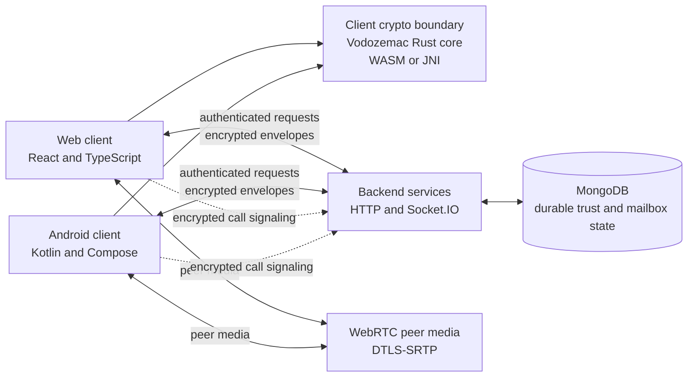
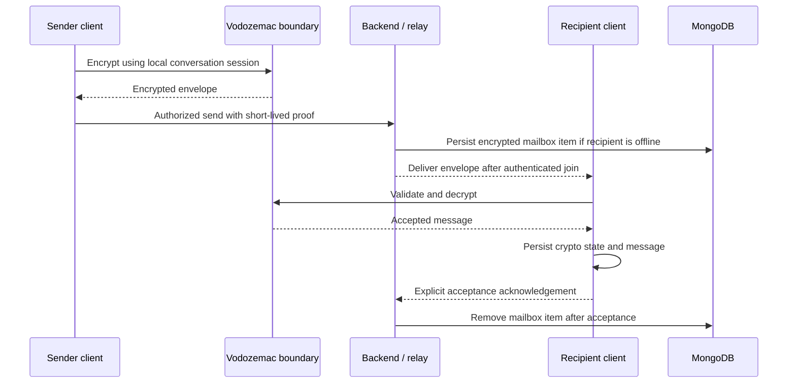
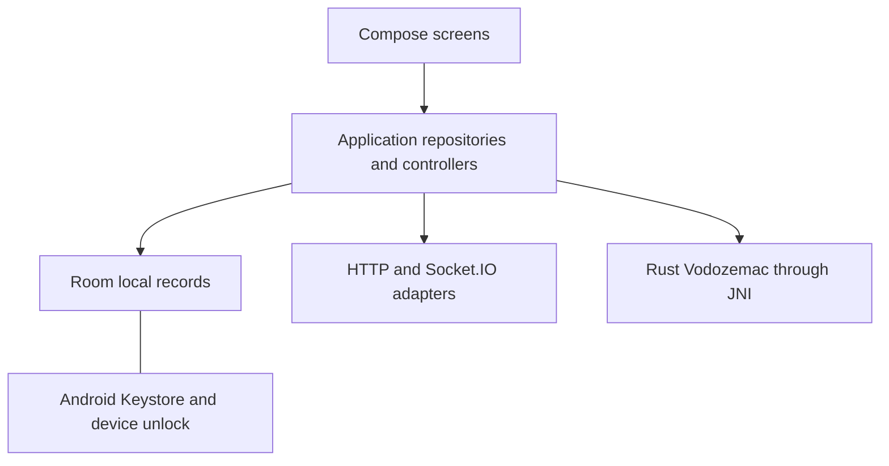

# K3NCRYPT Engineering Documentation

**Document type:** Product and architecture overview
**Status:** Private beta preparation
**As of:** 27 September 2026
**Audience:** Engineering, security review, product, and beta operations

> This document describes the product and implementation state recorded in the supplied K3NCRYPT Project Master Document and K3NCRYPT Beta Readiness Document. It does not assert independent security certification or production readiness. Where implementation detail is needed, it uses the repository's architecture and phase reports; older reports may describe earlier milestones and are identified as historical where applicable.

## 1. Executive summary

K3NCRYPT is a private communications application built around device-held identity, explicit contact verification, encrypted messaging, offline delivery, and voice calls. Its intended users are people who want private one-to-one communication without making an email address or phone number the cryptographic identity.

The product separates identity and trust from transport. A client creates and retains its cryptographic identity. Contacts must be explicitly verified. The backend authenticates protected operations, routes encrypted envelopes, and retains encrypted mailbox items until a recipient accepts them. It does not need message plaintext or private identity keys to perform those jobs.

The supplied project documents report the core messaging, offline delivery, voice calling, QR contact onboarding, device identity, trust verification, and Android secure unlock as completed milestones. K3NCRYPT remains in private beta preparation. Final UI refinement, installation and onboarding validation, and real user testing remain. File sharing and voice messages are listed as unavailable; call history and contact profiles are limited.

The long-term K3NCRYPT Node and site-to-site networking idea is a future vision. It is not part of the current beta product.

## 2. Product status and scope

| Status | Scope |
|---|---|
| **Completed** | Device identity and explicit fingerprint verification; encrypted one-to-one messaging; offline message delivery; voice calling; QR contact onboarding; Android local secure unlock; security hardening and test/build validation as reported by the supplied project documents. |
| **In progress** | Final UI refinement; installation testing; onboarding validation; private-beta user testing. |
| **Planned** | Improve contact profiles and call history; implement and validate file sharing and voice messages before advertising them as available. These are current limitations, not completed features. |
| **Future** | K3NCRYPT Node, private tunnels, and site-to-site networking between trusted locations. These concepts have no current beta availability claim. |

The project master and beta readiness documents are the source of truth for product status. Detailed security and implementation claims below are limited to those documents and the supporting repository documentation.

## 3. System architecture

### 3.1 Logical view

### 3.2 Responsibility boundaries

| Component | Responsibility | Does not own |
|---|---|---|
| Web client | Browser experience, local vault interaction, conversation and call controls. | Server-authoritative trust decisions or private-key export. |
| Android client | Native app experience, device unlock, local persistence, permissions, and Android networking/media adapters. | A separate identity system or Kotlin cryptographic implementation. |
| Vodozemac Rust core | Device identity signing and Olm account/session operations through platform bindings. | User-interface or product decisions. |
| Backend | Lifecycle and proof authority, authenticated API/socket admission, routing, and encrypted mailbox persistence. | Decrypting conversation messages or handling WebRTC media. |
| MongoDB | Durable backend trust, nonce, membership, and mailbox records used by configured services. | Client private keys or message plaintext. |
| WebRTC | Live audio/video transport between endpoints using DTLS-SRTP. | Contact identity verification or K3NCRYPT's device trust authority. |

### 3.3 Message and trust path

The acknowledgement order is part of the reliability and security boundary: a delivery is not accepted merely because it reached a socket. The recipient must validate and persist it before positive acceptance.

## 4. Security model

### 4.1 Security objectives

K3NCRYPT is designed so that conversation content and private device identity material remain under client control. The backend verifies authorization and transports encrypted content. The clients retain the cryptographic operations needed to create identities, establish sessions, sign control events, and encrypt or decrypt messages.

The design preserves these boundaries:

- Cryptographic private keys are generated and held on client devices through the Vodozemac boundary.
- Message encryption and decryption occur on clients.
- The backend validates lifecycle state, proof scope, replay controls, and routing permissions without receiving message plaintext.
- Encrypted offline messages remain stored until the recipient validates, persists, and acknowledges them.
- User-interface code presents existing trust state; it must not grant trust or bypass a service decision.

### 4.2 Server-visible information

The backend must see enough information to authenticate and route requests. This includes device and conversation routing references, operation/resource scope, lifecycle epochs, connection and delivery timing, message-envelope sizes, and online/offline state. MongoDB stores durable control-plane records and encrypted mailbox data.

The security model does not claim that transport metadata is hidden. A compromised unlocked endpoint, a compromised operating system or browser, malicious code executing in the application origin, network observation, and denial or delay by the relay are outside the protection offered by message encryption alone.

### 4.3 Voice calls

Call control signals use the authenticated encrypted conversation signaling path and operation-scoped relay authorization. The backend forwards signaling and does not process audio or video media. WebRTC applies DTLS-SRTP to live media transport. This is not a claim that the backend or network metadata is invisible, nor a claim of production TURN readiness.

### 4.4 Security invariants

1. Never replace Vodozemac or create a parallel cryptographic identity system.
2. Never automatically trust a contact after scanning an invitation.
3. Never accept a protected operation without current authorization and lifecycle validation.
4. Never delete an offline message before recipient acceptance.
5. Never store a plaintext unlock passphrase for convenience.
6. Never present a planned feature as a working security control.

## 5. Identity model

K3NCRYPT uses device-based identity. A device creates its identity locally through Vodozemac; the private part remains on that device. The public verification identity can be represented to users as a fingerprint for out-of-band comparison.

An invitation helps two clients locate and initialize a conversation, but invitation possession is not equivalent to verified identity. The receiving user must compare the contact's security fingerprint through an independent trusted channel and explicitly confirm it. A changed identity requires renewed review rather than silent replacement.

Network routing identifiers, socket identifiers, conversation identifiers, device references, and cryptographic identities are different concepts. Routing identifiers help deliver traffic; they are not proof of who a person is. Normal screens should show contact labels and trust state, with detailed fingerprint comparison in an explicit verification view.

The model does not depend on an email address or phone number as the cryptographic identity. The supplied documents do not specify a public account directory or identity recovery service; this document does not assume either exists.

## 6. Trust and authorization model

Trust begins with a device identity and explicit contact verification. The durable lifecycle authority records device state and trust epochs. Existing trusted devices authorize additional device enrollment; signed activation and revocation events update the durable record. Revocation must invalidate later protected operations using that device.

Clients request short-lived authorization proofs for protected actions. Proofs bind the device, account, operation, expiry, nonce, epoch, and relevant resource. The backend checks proof authenticity against durable lifecycle state and prevents replay. A proof is authorization for a scoped action; it is not a replacement for the device identity or contact-verification model.

The browser and Android user interfaces must treat backend responses as authoritative. They can display statuses such as “Verified contact,” “Secure connection established,” “Needs review,” or “Unavailable,” but must not decide that a revoked or stale device is trusted.

## 7. Messaging architecture

### 7.1 Send

1. The client checks local conversation and trust readiness.
2. Vodozemac encrypts the message using the conversation session.
3. The client persists required local message/session state and sends the encrypted envelope with current authorization.
4. The backend routes it to an online recipient or retains the encrypted mailbox item for later replay.

### 7.2 Receive and offline delivery

1. The recipient restores its identity and conversation state and authenticates to the relay.
2. The relay replays retained encrypted envelopes after join succeeds.
3. The client validates the envelope, sender binding, trust state, and replay state.
4. Vodozemac processes and decrypts the message.
5. The client commits message and crypto/session state locally.
6. The client sends explicit acceptance; only then may the relay remove the mailbox item.

This ordering protects against losing a message because a client acknowledged before it had durably processed it. Invalid, stale, replayed, or unpersistable content must not result in positive acceptance.

### 7.3 Current feature boundary

Text messaging and offline delivery are reported complete. The supplied beta readiness document lists file sharing and voice messages as unavailable. They remain separate product work and must not be inferred from the presence of a media interface or future API boundary.

## 8. Voice architecture

K3NCRYPT voice calls use a control plane and a media plane:

- **Control plane:** invitation, accept/reject, offer/answer, and ICE signaling travel through the existing encrypted conversation signaling boundary and are authorized by short-lived device proofs.
- **Media plane:** browser and Android WebRTC implementations exchange live audio directly where network conditions allow. DTLS-SRTP protects media transport. The backend routes encrypted signaling and does not terminate the media stream.

Microphone permission is requested in response to a user's call action. Call screens expose the current call state, mute, and hang-up controls. Voice calling is reported as a completed product milestone. Call history remains limited, and the supplied documents do not claim that all network environments, TURN deployment, or scale requirements have been validated for production.

Voice messages are distinct from voice calls. They are listed as unavailable in the beta readiness document.

## 9. Android architecture

The Android app uses Kotlin and Jetpack Compose for native presentation. Its project includes application, core, crypto, network, storage, security, messaging, media, and calls modules. Hilt composes dependencies. Room provides structured local persistence, while Android Keystore protects local encryption keys and device-authenticated unlock.

The Rust/Vodozemac implementation is accessed through a native JNI boundary. Kotlin is an adapter and application layer; it must not implement cryptographic algorithms or export private keys. Compose screens display identity, conversation, permission, and call state while invoking existing repositories and controllers.

Android secure local unlock, QR onboarding, messaging, and voice calling are reported as completed milestones. The beta readiness document still calls for installation testing, onboarding validation, and final UI refinement. File sharing and voice messages are not available in the Android product UI. The product documents also list limited contact profiles and limited call history.

## 10. Web architecture

The web client is implemented in React and TypeScript. It presents onboarding, invitation/QR contact setup, conversation and call UI, settings, and explicit identity-verification controls. The service SDK supplies conversation, trust, media, and call operations to the client. The browser crypto integration uses the Vodozemac Rust/WASM boundary for modern device identity and session operations; browser local vault persistence is separately protected and requires explicit unlock.

The web client must not use UI state as a substitute for authorization. It should request proofs through the service layer, present the resulting status in plain language, and keep fingerprints behind explicit identity-verification actions. The provided beta-readiness document does not specify cross-browser compatibility results; no such guarantee is made here.

## 11. Backend architecture

The backend provides HTTP APIs and Socket.IO transport. It handles device lifecycle events and durable state, nonce/replay protection, proof verification, resource authorization, conversation routing, encrypted mailbox retention, and signaling relay. MongoDB provides durable state for backend authorities and mailbox items.

For messaging and calls, the backend forwards encrypted envelopes and applies admission checks; it does not decrypt the user's conversation content or carry WebRTC media. It can observe routing and operational metadata required to provide the service. Availability, timing, traffic size, and network metadata remain visible to infrastructure operators.

Private-network membership authority exists as a separate backend capability in the repository. It is part of the broader networking foundation, not a claim that end-user site-to-site tunnels are available in the current beta.

## 12. Testing and validation strategy

Testing should be reported by layer so that a passing unit suite is not confused with a live product flow.

| Layer | What it verifies | Evidence boundary |
|---|---|---|
| Rust/Vodozemac tests | Crypto boundary operations, account/session persistence, and protocol behavior. | Does not prove full app integration. |
| TypeScript and Kotlin unit tests | Contract parsing, lifecycle/proof behavior, UI state, message framing, and client adapters. | Does not prove real device or network behavior. |
| Backend integration tests | Mongo persistence, lifecycle transitions, replay controls, mailbox acceptance, and relay authorization. | Must use configured Mongo integration environment for persistence claims. |
| Build and lint checks | Source compiles and static lint rules pass for the selected targets. | Does not establish UX, security certification, or production readiness. |
| Cross-client end-to-end tests | Browser/Android message direction, persistence-before-ACK, offline replay, and voice-call flows. | Must preserve persistent device state and use real configured services. |
| Beta user testing | Installation, onboarding clarity, contact addition, verification, chat, and call usability. | Still required by the supplied beta-readiness document. |

Reports should name the command, environment, test count, skips, and first failing boundary. Mongo-dependent tests must not be replaced by mocks when validating durability. Device testing must preserve the persistent beta profile when identity restoration is under test.

## 13. Roadmap

### Private beta preparation - in progress

- Complete UI refinement on web and Android.
- Validate install, unlock, QR onboarding, fingerprint verification, messaging, and calling with non-technical users.
- Improve contact profile presentation and call history.
- Confirm release builds and environment configuration without exposing debug or development conveniences.

### Product capabilities - planned

- File sharing with the existing encrypted attachment design and platform workflows.
- Voice messages with a cross-platform media format and explicit record/playback UX.
- More complete contact profiles and call history.

These items are listed as remaining or unavailable in the source documents. They are not represented as active implementation work unless a separate current plan says so.

### Networking vision - future

- Trusted K3NCRYPT nodes at private locations.
- Encrypted tunnels between independently managed nodes.
- Site-to-site access between private LANs.

This future direction requires separate design, threat modeling, implementation, and validation. It is not a feature of the current private beta.

## 14. Known limitations and release posture

The project is in private beta preparation, not declared production-ready. Current documented limitations include:

- no available file sharing or voice messages in the product baseline described by the beta-readiness document;
- limited call history and limited contact profiles;
- final UI refinement, real user testing, onboarding validation, and installation testing remain;
- the source documents do not establish production-scale backend operations, universal network reachability, or a deployed TURN service;
- future node/tunnel networking is only a vision.

Security claims should stay tied to tested behavior. Build success, unit tests, and architecture intent do not by themselves establish full end-to-end behavior or guarantee protection against compromised endpoints.

## 15. Source documents and implementation references

### User-provided source documents

- `K3NCRYPT_PROJECT_MASTER_DOCUMENT.md` - product vision, architecture summary, completed milestones, and future networking vision.
- `K3NCRYPT_BETA_READINESS_DOCUMENT.md` - beta completion claims, remaining UX work, known limitations, and release checklist.

### Repository references

- `docs/ARCHITECTURE.md` - client, crypto, transport, and identity boundaries.
- `docs/IDENTITY.md` - device and contact identity model.
- `docs/K3NCRYPT_SECURITY_MODEL_V1.md` - threat model and security boundaries.
- `docs/PHASE9_1_FINAL_REPORT.md` and `docs/PHASE9_2_ANDROID_MESSAGING_REPORT.md` - Android implementation history; read with their historical status notes.
- `docs/PHASE9_3_CALL_ARCHITECTURE.md` - call control/media separation and validation scope.
- `docs/DEPLOYMENT_PREPARATION.md` - deployment preparation requirements.

Where an older repository report conflicts with the supplied master and beta-readiness documents on current product status, this document follows the supplied documents and avoids stronger claims.
