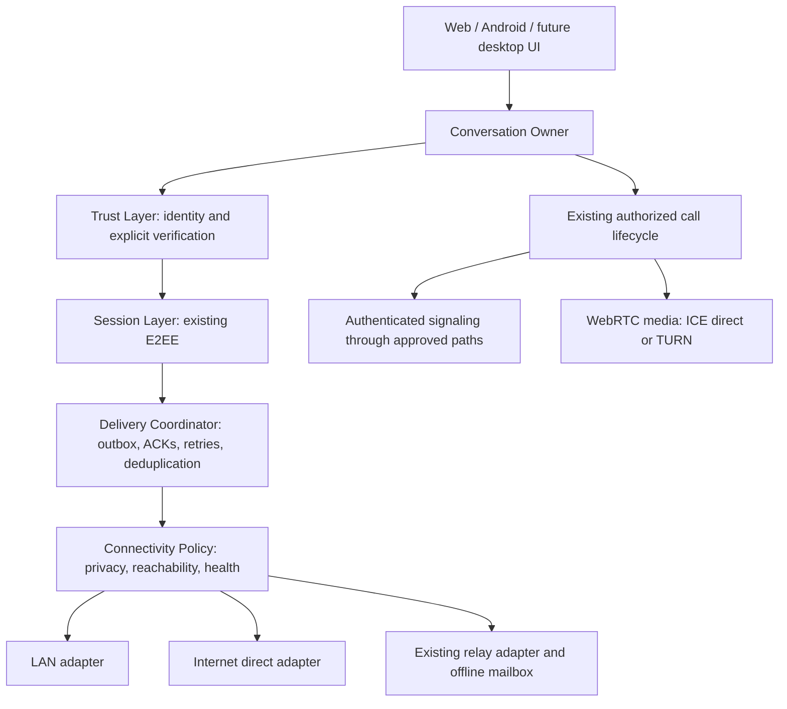

# K3NCRYPT Future Connectivity Architecture

| Document property | Value |
| --- | --- |
| Architecture version | 1.0 |
| Date | 2026-09-29 |
| Status | Official future architecture direction; implementation is phased and gated below |
| Source baseline | `b4f16b1` on `origin/main` |
| Scope | Messenger-level connectivity for Web, Android, and future desktop clients |
| Change in this specification | Documentation only; no production behavior, protocol, identity, storage, or migration changes |

## Purpose and decision

K3NCRYPT will support one secure conversation over multiple communication paths: a same-LAN connection, a direct internet connection, and the existing relay and offline mailbox. The application will choose a healthy path within the user's privacy policy while preserving device identity, explicit fingerprint verification, and the existing end-to-end encryption model.

This is a messenger-level transport overlay. It carries K3NCRYPT application traffic. It does not create an operating-system VPN, a TUN interface, or general connectivity between other applications on two LANs.

The current working beta remains the compatibility baseline. Future connectivity work must occur in separate branches. This document authorizes an architectural direction, not deployment of an unfinished protocol or automatic migration of existing conversations.

**MUST**, **MUST NOT**, and **SHOULD** express requirements for future implementations. Proposed interfaces and directories are responsibility boundaries, not instructions to move existing files immediately. Items marked **design gate** require a reviewed specification before implementation of the affected production path.

## 1. Current system analysis

### 1.1 Working beta and evidence boundary

The established beta supports encrypted messaging, explicit identity verification, voice calls after verification, Web and Android clients, relay delivery, and persisted conversations. This document describes source behavior and the established product baseline; it is not a new release certification or a claim that operational tests were run for this document.

Historical release checklists and phase reports may describe earlier deployments. Runtime configuration, deployed TURN availability, APK provenance, and real-device results require their own current evidence.

### 1.2 Existing relay model

The main relay uses Socket.IO rooms and conversation-scoped routing addresses. Joining binds a socket to its authorized conversation and device state. Room capabilities, routing authorization, and device authorization are distinct from human fingerprint verification. Message and call-signaling sends pass through relay authorization checks. Offline mailbox replay and acknowledgements also check socket/device lifecycle state.

The relay receives opaque encrypted envelopes but observes routing and activity metadata. It is an authorization authority for its own services, not an authority that can mark a contact verified. A web deployment operator additionally controls the JavaScript delivered to browsers; end-to-end encryption does not eliminate that web code-delivery trust boundary.

Relevant source:

- [Socket.IO adapter](../service/src/transports/socketIoRelayTransport.ts)
- [Relay listeners and acknowledgements](../backend/socket.io/listeners.ts)
- [Device proof authority](../backend/security/durableDeviceTrust.ts)
- [Mailbox persistence](../backend/db/index.ts)

### 1.3 Existing identity and verification model

Messaging identity belongs to a device and is backed by the existing Vodozemac account. Names and nicknames are presentation labels. Room IDs, socket IDs, routing addresses, and server account references are not substitutes for cryptographic identity.

The invitation gives the joiner an identity commitment for the inviter. The encrypted join introduction supplies the reverse contact association. Contact observation creates or updates identity information without granting verification. Fingerprint confirmation is explicit. An identity change enters review; accepting a replacement does not silently preserve verified status for the replacement.

Text messaging and privileged actions need not have identical gates. The existing beta's operation-specific trust rules remain authoritative. In particular, calls require a verified, unchanged contact and a usable session. Connectivity MUST NOT introduce a second verification policy.

Relevant source:

- [Contact identity registry](../service/src/identity/contactIdentityRegistry.ts)
- [Modern conversation and join introduction](../service/src/crypto/modernConversation.ts)
- [Authenticated call composition](../service/src/calls/composition.ts)
- [Web conversation integration](../client/src/context/ChatContext.tsx)

### 1.4 Existing session and delivery handling

`ModernConversation` coordinates session restoration, authenticated receive, contact observation, outbox/retry behavior, replay state, and call support. Vodozemac state is persisted through existing encrypted storage. Session operations are serialized through the current ownership/locking mechanism. Future work MUST preserve its security guarantees and characterize concurrency behavior before restructuring it.

Receiver acceptance controls acknowledgement. Successful transport submission, mailbox storage, and receiver acceptance are different outcomes. The mailbox supports retryable delivery; local persistence and replay ordering must prevent both message loss and duplicate presentation.

The SDK already defines opaque envelope and transport contracts. `DefaultTransportManager` currently delegates to a single transport. Its join API carries relay-specific parameters, and `ModernConversation` includes relay-specific mailbox operations. These are the initial integration seams, not a completed multipath implementation.

- [Core contracts](../service/src/core/contracts.ts)
- [Current transport manager](../service/src/transports/transportManager.ts)
- [Session repository](../service/src/identity/vodozemacSessionRepository.ts)
- [Web conversation descriptors](../client/src/product/sessionStore.ts)

### 1.5 Current limitations relevant to connectivity

- Invitation creation and prekey lookup/claim currently use server services; existing invitation QR support is not a fully offline pairing protocol.
- There is no production LAN discovery and authenticated direct-message adapter established by this review.
- Relay routing is designed around two participants per conversation. Device enrollment does not by itself establish multi-device message fan-out.
- The existing private-network modules contain membership, route selection, and bridge foundations. They do not constitute a deployed LAN mesh or OS-level VPN.
- A phone or browser is not guaranteed to remain reachable in the background. Offline mailbox delivery still depends on a client reconnecting.
- Direct call success on one network does not establish universal NAT traversal. ICE server configuration and TURN operation require separate validation.

## 2. Future connectivity architecture

### 2.1 Layer model

Trust is a policy dependency, not a network hop. Media remains in the WebRTC media subsystem; the diagram does not place audio inside the messaging ratchet or require messages and calls to share a PeerConnection.

| Layer | Owns | MUST NOT own |
| --- | --- | --- |
| Conversation Owner | One conversation's lifecycle, operation serialization, authoritative state publication, coordination of persistence and shutdown | A competing trust policy in React or Compose |
| Trust Layer | Device identity association, fingerprint verification, identity-change handling, operation authorization | Endpoint discovery, automatic trust based on connectivity |
| Session Layer | Existing authenticated encryption, session restoration and health, private cryptographic state | Route scoring or transport credentials |
| Delivery Coordinator | Durable pending work, retry scheduling, outcome classification, replay/deduplication coordination | Ratchet mutation outside the conversation owner, plaintext routing, verification decisions |
| Connectivity Policy | Allowed path classes, candidate health, switching and retry budgets | Keys, private identity material, permission to override trust gates |
| Path Adapters | Opaque envelope transfer, bounded framing, connection lifecycle, transport outcomes | Decryption, contact creation, marking messages accepted by the peer without evidence |

### 2.2 Ownership and delivery contract

1. The conversation owner authorizes the operation and serializes session work. Multiple paths MUST NOT independently advance the same session.
2. A send records recoverable pending work under the existing storage guarantees before reporting a durable local outcome. Persisting ratchet state and encrypted outbox state MUST NOT introduce a crash window that loses recoverability.
3. The delivery coordinator selects an eligible authenticated path. Retries reuse the pending encrypted envelope where the existing protocol permits; they do not re-encrypt merely because the route changed.
4. Incoming traffic is size/schema checked, associated with the intended authenticated peer, and passed to the same session and trust checks regardless of path.
5. Receiver acceptance follows successful validation and required persistence. Invalid input MUST NOT produce a successful acceptance receipt.
6. A duplicate accepted delivery may produce an idempotent receipt without a second UI message or a second ratchet operation. It MUST be matched to an authenticated, previously accepted record.

Conceptual outcomes are `locally pending`, `transport submitted`, `mailbox stored`, `peer accepted`, and `failed/expired`. These are design semantics, not new wire events or a request to change beta UI labels. A transport ACK is not a read receipt. A direct adapter MUST NOT fabricate a server ACK.

**Design gate:** document the current identifiers and ACK bindings before selecting cross-path message IDs or introducing a peer receipt. New authenticated fields require versioned protocol review; an unauthenticated outer ID is insufficient for security-sensitive deduplication.

### 2.3 Path policy and switching

Paths progress through candidate, connecting, authenticated/usable, degraded, and closed states. Only an authenticated, policy-allowed path can carry application traffic. Connectivity and verification are separate state dimensions.

The future policy supports automatic routing, relay-only routing, and an explicit local-only mode. Direct paths disclose network information to peers. Relay-only means avoiding direct exposure to contacts; it does not hide the user's IP from the relay or TURN operator. Local-only MUST NOT silently make remote discovery, STUN, TURN, proof, or mailbox requests.

Automatic routing SHOULD keep a usable relay available while testing a direct candidate. Prefer healthy direct paths when allowed, with hysteresis and bounded retry budgets to avoid oscillation. Persist conversation state, not stale ICE candidates as trusted routes. Expired route hints must be rediscovered and reauthenticated.

Initial multipath delivery SHOULD send through one selected path at a time. If its acceptance outcome is unknown, fallback may repeat the same envelope. Receiver deduplication must make this safe. Once the peer has authentically accepted a message, do not additionally queue it for offline delivery. Path loss never means an identity change or automatic session renewal.

## 3. Transport roadmap

| Phase | Deliverable | Dependencies and exit gate |
| --- | --- | --- |
| 1. Transport abstraction without behavior changes | Characterization tests; transport-neutral delivery seam; current relay adapter remains the sole production path | Relay send, replay, authorization, persistence, calls, and legacy compatibility behavior remain unchanged. No new wire format or migration |
| 2. LAN for already paired contacts | Opt-in native discovery and an authenticated local path for existing paired contacts with usable sessions | Reviewed peer binding and offline authorization policy; internet-disabled Android device tests; duplicate, restart, spoofing, and permission tests |
| 3. Direct internet path selection | Authenticated rendezvous; evaluated WebRTC data-channel adapter; privacy-aware ICE/TURN and relay fallback | Cross-network Web/Android tests, policy-enforced candidate handling, bounded switching, mixed-version fallback, operational TURN validation |
| 4. Site-node concept | Scoped K3NCRYPT forwarding between authorized nodes; desktop node foundation and limited pilot | Node admission, revocation, freshness, loop prevention, quotas, update/operations review; endpoints retain E2EE and trust authority |
| 5. Future federation possibility | A decision record and separate feasibility/security specification if multi-operator delivery is required | Explicit product approval, addressing and abuse model, compatibility/migration plan, hostile-server test design; no federation implementation authorized here |

A dummy-data LAN/ICE spike may precede Phase 1 to validate platform feasibility. It must be isolated from production sessions and cannot be promoted directly into production.

Offline first-contact pairing is a separately gated extension after Phase 2. It is not required to prove LAN communication between existing contacts and MUST NOT be added incidentally to the transport abstraction.

## 4. LAN mode

### 4.1 Discovery

Discovery locates candidate services; it does not authenticate devices. Native clients may use DNS-SD/mDNS through platform APIs, with user-controlled advertising, bounded discovery windows, and no stable names, fingerprints, contact lists, or invitation secrets in advertisements.

Rotating rendezvous hints are a possible privacy mechanism, not an anonymity guarantee. Their derivation, linkability, size, collision behavior, and clock handling need review. The app's presence, IP/MAC-level observations, timing, and volume can remain visible to a local observer. Do not create a new shared-secret scheme casually to conceal discovery.

Handle multicast filtering, guest-Wi-Fi isolation, captive portals, address changes, IPv4/IPv6, permission denial, and unavailable network interfaces. Discovery failure MUST leave relay behavior intact when internet use is allowed; in local-only mode it must report local unavailability without contacting internet services.

### 4.2 Authentication and identity binding

For an existing contact, a local connection must prove possession of the expected device's authenticated key/session context with fresh challenge material. The proof must bind the intended conversation, both endpoint roles, negotiated version/capabilities, and connection attempt. A raw routing address, self-signed announcement, TLS/WebRTC connection alone, or echoed nonce is insufficient.

The exact peer handshake is a **design gate**. Use established reviewed mechanisms and the existing identity/session implementation; do not invent cryptographic primitives or copy a relay HMAC secret to peers. Session, signature, replay, and identity-mismatch checks remain mandatory.

An established session is not evidence that a device is currently authorized after revocation. Local policy must reject locally known revoked or changed identities. An offline peer cannot prove it has learned the latest remote revocation. The Phase 2 specification must define when cached authorization is acceptable and when freshness requires reconnection or a fail-closed result. A higher sequence number alone is not proof of a unique current membership state.

### 4.3 Offline pairing and QR exchange

**Discovery is not authentication. Connection is not trust. Verification remains user-controlled.**

A future offline invitation may carry a versioned public identity commitment, scoped pairing material, and the public session-setup material required by the existing cryptographic protocol. Private identity keys and vault secrets MUST NOT appear in it. Pairing capabilities are sensitive even when all key material is public.

Before implementation, specify:

- One-time-key reservation/consumption, repeated scans, concurrent claims, and fallback-key behavior without a central claim service.
- Expiry, cancellation, replay, QR capacity, interruption, and device restart during pairing.
- Mutual identity association so both sides can review the contact before either sends normal chat.
- Opaque local conversation identity and its later association with an authorized relay route; no silent replacement of existing identity/session state.
- Handling of stolen invitations and identity mismatch, with no success ACK for rejected pairing.

Both parties remain unverified until explicit fingerprint comparison and confirmation. Scanning an invitation, scanning twice, or receiving a valid encrypted introduction MUST NOT independently grant verified status. A standalone verification QR may support the existing explicit ceremony but cannot silently redefine it.

## 5. Internet direct mode

### 5.1 Candidate technology

WebRTC data channels are the preferred technology to evaluate because browsers expose them and Android already has WebRTC experience. They are not a mandate to couple messaging to an active call's PeerConnection. Separate data and media connection lifetimes initially; sharing requires a later measured lifecycle review.

Evaluate bounded message framing, maximum sizes, fragmentation if needed, backpressure, connection setup cost, Android battery/memory use, cross-platform behavior, and shutdown. Continue application E2EE over a data channel. DTLS transport protection does not replace K3NCRYPT identity binding or fingerprint verification.

ICE gathers and checks candidate paths. STUN assists address discovery; TURN relays live traffic when a usable direct path is unavailable. Host candidates may work without STUN on reachable networks; an empty ICE-server list does not prove all direct internet communication is impossible. Conversely, configuring STUN does not guarantee NAT traversal.

### 5.2 Rendezvous and fallback

Online rendezvous must authenticate candidate/offer association with the intended peer and conversation. Prefer an existing authenticated signaling path where a session already exists. Avoid circular bootstrap: a new data channel cannot be the only channel needed to authenticate its own setup. Unestablished-session first contact continues using the beta flow until an explicitly reviewed alternative exists.

Differentiate three services:

| Service | Purpose | Does not provide |
| --- | --- | --- |
| Rendezvous | Exchange connection information | Guaranteed direct reachability or offline delivery |
| TURN/live helper | Forward live encrypted traffic | A durable mailbox for an absent peer |
| Existing relay/mailbox | Authorized online delivery and durable bounded offline retention | Invisible metadata or automatic peer trust |

Direct paths are an optimization. An offline recipient still requires the mailbox, or a separately approved durable node service. If internet rendezvous is unavailable, a new internet peer connection cannot be guaranteed. If all paths are unavailable, retain bounded pending work and report its real status.

Relay-only policy must constrain both candidate gathering/exchange and selected paths, with tests for IP disclosure. TURN credentials must be scoped and short-lived under an operationally reviewed mechanism. Candidate handling must not become arbitrary local-network scanning or server-side request forgery.

### 5.3 Platform responsibilities

| Platform | Appropriate capabilities | Constraints |
| --- | --- | --- |
| Browser | WebRTC, authenticated online signaling, later QR/paste local signaling | No general-purpose mDNS service advertisement or raw listening socket; secure-context and permission rules; tab suspension; offline launch needs cached assets; origin changes affect vault access |
| Android | NSD/local discovery, native networking, WebRTC | Local-network/microphone permissions, OS background limits, foreground-call lifecycle, battery and Wi-Fi isolation; no promise of continuous reachability |
| Desktop | Persistent discovery, native paths, possible always-on node | Key custody, signed updates, firewall prompts, resource limits, process isolation, and OS-specific packaging |

Platform API requirements must be checked against the supported OS/browser versions at implementation time. A local browser node endpoint also needs a viable HTTPS/origin/permission design; do not solve it by disabling browser security or allowing arbitrary cleartext production access.

## 6. Site-to-site concept

Initially, a site is a user-understandable collection of explicitly authorized K3NCRYPT devices and an optional node. A home node and an office node may forward application ciphertext for authorized endpoints. The endpoints retain session keys, identity verification, and message acceptance authority.

Node authorization grants narrowly scoped forwarding rights, not contact verification, device enrollment authority, or plaintext access. Both ends of a forwarding relationship must approve their participation. Define destination scope, quotas, expiry, revocation, trust-state freshness, maximum hops, loop detection, and retention. Default to no forwarding grant.

A malicious node may drop, delay, replay, or correlate traffic. Endpoints must detect authentication failures and duplicates. Node possession of ciphertext must not permit decryption, forged peer acceptance, or contact-state changes. Durable node storage is a separate feature requiring its own quotas and ACK semantics; the initial live-forwarding pilot must not imply mailbox durability.

Existing private-network membership and bridge modules remain unchanged during early phases. Reuse follows review, not naming similarity. TUN/Wintun/VpnService interfaces, CIDR bridging, general TCP/UDP service access, and network-wide DNS are out of scope.

Future IP networking or independent-server federation would need separate product approval, threat models, and migration plans. Neither is required for this architecture.

## 7. Security threat model

Assets include plaintext, identity/session keys, vault contents, verified-contact state, conversation membership, routing privacy, delivery integrity, and service availability. Attackers include malicious LAN devices, network observers, compromised relays/helpers, malicious peers, and stale or incompatible clients. A fully compromised unlocked endpoint can access its own plaintext; transport encryption cannot repair that boundary.

| Threat | Mandatory response or limitation |
| --- | --- |
| LAN spoofing | Treat advertisements as hints; authenticate expected peer; bound attempts and allocation; reject unknown peers outside explicit pairing |
| Route substitution | Bind connection and route updates to authenticated conversation/device context; reject identity mismatch; endpoint reachability is not identity |
| Replay across paths | Preserve session replay defenses; durable authenticated deduplication; idempotent acceptance; no second display or ratchet advance |
| Malicious helper | Ciphertext only; scoped admission, quotas, expiry and hop limits; no helper-issued trust or peer-acceptance assertions |
| IP exposure and correlation | Enforce path privacy policy; disclose operator visibility; minimize candidate logs; rotating discovery hints do not provide anonymity |
| Stale identity/revocation | Reject known changes/revocation; define offline freshness policy; never trust an unvalidated higher epoch or silently resolve conflicting histories |
| Version mismatch/downgrade | Authenticate security-relevant capability negotiation; reject unsupported required semantics; fallback only to an explicitly supported secure path |
| Session concurrency/crash | One serialized owner; preserve transactional/recoverable session-outbox state; fault-injection tests around persistence and ACK |
| Resource exhaustion | Bounded frames, queues, retries, discovery, candidates and per-peer connection counts; reject malformed input before costly allocation |
| Web code substitution/XSS | Retain the web delivery trust disclosure; web hardening belongs to a separate release-security workstream; connectivity does not remove this risk |

No transport or UI component may mark contacts verified. Existing relay authorization, mailbox security, identity generation, cryptographic primitives, and verification rules remain unchanged unless a separately authorized security project explicitly revises them.

## 8. Module boundaries

| Repository area | Future responsibilities | Guardrails |
| --- | --- | --- |
| `service/src/crypto`, `identity`, `calls`, `storage` | Existing secure session, identity, call policy and encrypted persistence authorities | Preserve APIs and behavior during Phase 1; no blanket rewrite |
| Proposed `service/src/delivery` | Pending-envelope state, receipt classification, retry and deduplication coordination | Session work remains serialized by conversation owner; no transport-specific trust |
| Proposed `service/src/connectivity` | Path policy, capability negotiation coordination, health and switching | No plaintext, key access, or verification writes |
| `service/src/transports` | Existing relay adapter; later peer adapter contracts/implementations | Keep relay-specific admission isolated; do not remove relay proof checks |
| Proposed `service/src/pairing` | Separately reviewed offline bootstrap orchestration and public-data validation | No new identity system; no automatic trust; protocol fixtures required |
| `client/` | UI for availability/policy, browser platform adapters, explicit verification presentation | Present SDK state; no parallel security state machine |
| `android/network` and app integration | NSD, permissions, native path adapters, lifecycle integration | Kotlin follows the same normative protocol and fixtures; retain native crypto boundary |
| `backend/` | Existing relay/mailbox and authorization; future scoped rendezvous if needed | No plaintext/session keys; no federation or authorization redesign in early phases |
| Future desktop/node module | OS networking integration, scoped forwarding, resource and update lifecycle | Separate process/security review before becoming an always-on node |

These modules need not all be created at once. Prefer a minimal extraction around measured coupling. Do not move protocol logic into a new shared Rust core as part of connectivity work. Shared fixtures and conformance tests remain required across existing implementations.

## 9. Testing strategy

| Area | Required scenarios and acceptance evidence |
| --- | --- |
| Relay compatibility | Fresh inviter/joiner in both first-message directions; join introduction; verification; offline replay; reconnect; proof rejection; calls and remote hangup; baseline behavior unchanged |
| LAN discovery | Real Android devices; permission denied/revoked; duplicate/spoofed advertisements; multicast filtering; client isolation; address/interface changes; bounded resource use |
| LAN authentication | Known paired peer succeeds; wrong key/role/conversation, replayed handshake and known revoked device fail; no contact trust mutation |
| Direct switching | Direct loss before/after peer persistence and before/after ACK; relay fallback and return to direct; no duplicate UI messages, lost outbox entries, or session reset |
| Offline mode | Internet physically disabled; pre-paired peers exchange and restart; local-only produces no remote requests; absent peer stays pending; cold browser load limits documented |
| Restart recovery | Sender crash around encrypt/persist/send; receiver crash around decrypt/persist/ACK; restore pending envelopes and accepted receipts safely |
| Replay protection | Same envelope across LAN/direct/relay and after restart; forged receipt or duplicate outer ID; replay cannot create a message or erase pending work without valid acceptance |
| Identity mismatch | Existing verified identity replaced; mismatched introduction/route; stale authorization; changed identity cannot regain verification through transport fallback |
| Mixed versions | New client with relay-only beta client; unknown optional path ignored; unsupported required security feature rejected; no silent crypto-mode fallback |
| Platform/calls | Browser-to-Android and Android-to-Android, different NATs, relay-only, background/foreground, microphone denial, call hangup and immediate recall |
| Site-node pilot | Unauthorized forwarding, loops, revoked grant, stale membership, helper replay/drop, quota exhaustion, and restart without trust escalation |

Use deterministic unit tests for policy/state transitions, shared protocol fixtures for encoding, integration tests with the real persistence backend, and fault injection for delivery ordering. Real-network tests must supplement emulators. Record platform/version, network topology, result, and sanitized reason codes; never capture payloads, invitations, credentials, fingerprints, or keys in routine diagnostics.

New wire structures require a written schema, size bounds, version rules, positive/negative fixtures, and parser fuzzing appropriate to their exposure. Do not assume one implementation generating its own vectors establishes independent conformance.

## 10. Developer implementation guide

### 10.1 What to build first

1. Start from a clean reviewed `main` commit in a separate worktree. Record the baseline and preserve unrelated changes.
2. Read the source references in section 1. Document current delivery and serialization behavior through characterization tests before extraction.
3. Run an isolated dummy-payload LAN/data-channel feasibility spike. Report Android/browser limits, permission behavior, network isolation, backpressure and resource cost.
4. Specify Phase 1 contracts and reproduce the relay-only baseline. Keep all current relay authorization and wire semantics unchanged.
5. Extract only the minimum delivery/connectivity seam needed for another adapter. A new module name does not justify restructuring cryptographic code.
6. Obtain review of the Phase 2 handshake, authorization freshness, and receipt/deduplication specification before connecting production sessions to LAN.
7. Implement one path and one platform combination at a time, then expand after its negative and recovery tests pass.

### 10.2 What not to build in this workstream

Do not implement a VPN, general LAN bridge, new account identity, automatic trust inheritance, federation, custom NAT traversal, shared crypto rewrite, or unreviewed offline invite format. Do not make the beta depend on an experimental node. Do not remove existing relay proofs to get a prototype working. Do not automatically migrate existing conversations, keys, fingerprints, or storage records.

### 10.3 Security review gates

Required review covers: peer authentication and transcript binding; offline pairing and one-time-key use; cross-path receipts and deduplication; persistence/ratchet concurrency; offline revocation policy; candidate privacy and probing; site-node grants; any wire-format or persisted-record change. Each gate needs a threat note, compatibility/rollback plan, and negative tests. Using an established crypto library does not remove the need to review protocol composition.

Open decisions must be resolved before their phase ships: exact direct handshake; authentication of receipt IDs; authorization freshness while offline; data-channel size/backpressure policy; offline QR protocol; node grant/retention semantics. Luna or another implementer MUST NOT invent these silently from illustrative descriptions in this document.

### 10.4 Branch and merge discipline

Use short-lived branches from updated `main`, for example `codex/transport-delivery-boundary`, `codex/lan-known-contacts`, `codex/direct-internet-path`, and `codex/site-node-pilot`. Offline pairing belongs on its own branch after its design review. An isolated `codex/spike-nearby-connectivity` is disposable research, not production code.

Keep behavior-preserving extraction separate from behavior changes. Every PR states affected boundaries, tests, limitations, and rollback. Production enablement requires explicit approval after the phase exit gate. `main` remains releasable and the existing beta path remains available. This documentation commit performs no migration or feature enablement.

## References

- [WebRTC browser API and data channels](https://www.w3.org/TR/webrtc/)
- [RFC 8445: ICE](https://www.rfc-editor.org/info/rfc8445/)
- [RFC 8656: TURN](https://www.rfc-editor.org/info/rfc8656/)
- [Android Network Service Discovery](https://developer.android.com/develop/connectivity/wifi/use-nsd)
- [Android foreground-service background restrictions](https://developer.android.com/develop/background-work/services/fgs/restrictions-bg-start)
- [Chrome local-network access guidance](https://developer.chrome.com/blog/local-network-access)

External platform guidance evolves. Recheck it for the targeted versions before implementation. Earlier project phase reports and external architectural reviews are supporting material; this specification defines the future connectivity scope, while current source and tested release artifacts define what is implemented today.
