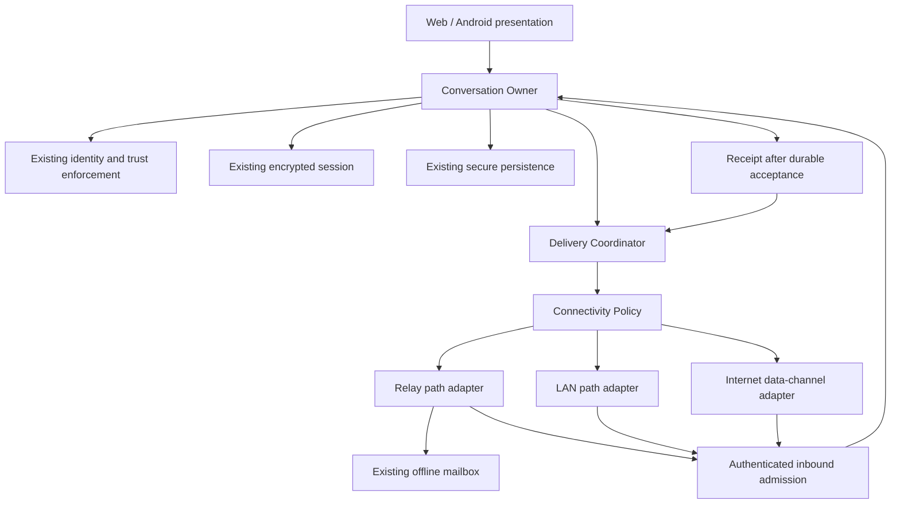

# K3NCRYPT Connectivity: Developer Handoff for Codex

**Status:** approved architecture with Phase 1I capability-negotiation specification; runtime implementation gates remain open · **Audience:** Codex (implementer) and the human reviewer
**Reviewed baseline:** `3e26ce952ea539ef7aaa9bb5db3d5dea4bf30f7f`, as stated in the approved specification. The source ZIP I analyzed has no `.git` directory, so I could not confirm this commit. Task 0.1 makes Codex verify it.
**Code references:** file and line numbers come from the reviewed ZIP. If `main` has moved, locate by symbol name instead.

---

## 0. Read this first

### 0.1 What this document is

It converts the approved connectivity specification and the security-review corrections into sequential engineering tasks. **It does not redesign anything.** If a task seems to require an architecture change, stop and ask (0.4).

Place this file at `docs/connectivity/HANDOFF.md` as the first commit on `connectivity/spec`. The task prompts in Section 5 refer to its sections.

### 0.2 Hard prohibitions (apply to every phase)

1. **No VPN, IP tunnel, TUN/VPN adapter or IP-level bridge.** The existing `service/src/privateNetwork/**` bridge and TUN scaffolding stay frozen and untouched.
2. **No federation.** No server-to-server delivery, federated addressing or operator authentication.
3. **No replacement of end-to-end encryption.** Message content stays under the existing vodozemac Olm session. Transports (DTLS, TLS) are additional layers, never substitutes.
4. **No weakening of verification.** Only the explicit fingerprint workflow verifies a contact. Connectivity never verifies anyone.
5. **No automatic LAN trust.** A discovered device is untrusted until it passes admission (M5) *and* is an eligible verified contact (M7).

Also out of scope: new account identity, delivery tokens, mailbox schema replacement, a shared-Rust protocol rewrite, custom NAT traversal, a public helper-node network, offline first-contact pairing (decision D16 is deferred), and any change to fingerprints, invitation format, message encryption or relay authorization proofs.

### 0.3 Global rules for every task

- **One branch, one reviewed boundary.** Work sequentially. Do not combine hardening, database changes and adapter code in one commit.
- **Read before you change.** Characterization tests come before behavior changes.
- **Relay-only stays the default.** Every new path sits behind a flag that defaults to **off**. Turning the flag off must restore relay-only behavior without rewriting identity, sessions or records.
- **Fail closed.** Unknown version, feature, type or field means reject.
- **Additive storage only.** New versioned records are fine. Existing records must keep loading with relay-only defaults.
- **New wire structures** need a version, a spec paragraph, a **new** fixture file in `protocol-fixtures/v1/` (never edit existing fixtures), and tests on both the TypeScript and Kotlin sides.
- **Android:** no cryptography in Kotlin. Keep `android/README.md` rules, including the disposable-AVD rules for instrumentation tests.
- **Do not rename existing callbacks or acknowledgements to "delivered".** Trace what each one actually means and document it (Phase 0).
- **No logging** of message content, keys, invitations, capabilities, fingerprints, or ICE/discovery candidate addresses. Only bounded reason codes and timings.
- **No new dependencies** without a stop-and-ask (0.4).
- **No unrelated refactors** or directory reshuffles.
- **Conventional Commits** (commitlint is enforced).
- **Every task ends with the report in Section 5.0.**

### 0.4 Stop conditions

Stop and request architectural and security review if a task appears to require any of these:

- changing fingerprints, invitation semantics, relay proofs, message encryption, or identity scope;
- accepting or trusting a peer without existing verification;
- a new cryptographic construction, key exchange or crypto dependency;
- a change to trust state, verification state or persisted conversation mode caused by a path event;
- fabricating or assuming freshness evidence;
- a server schema change or a backend change not listed as allowed;
- enabling any non-relay path by default.

### 0.5 Parallel work that is NOT part of this handoff

The beta security findings (reachable legacy entry points, mailbox insert-error handling and storage quotas, missing production security headers, rate-limiter bookkeeping, multi-tab session ownership) belong to a **separate release-audit backlog**. Each gets its own `hardening/<finding>` branch after reproduction against the deployed artifact. **Never mix them into connectivity branches.** Connectivity tests must not depend on hardening work landing first.

### 0.6 Deviations from your requested branch list (flagged, minimal)

| Deviation | Why |
|---|---|
| One extra branch, `connectivity/lan-messaging` | The approved rule says a feasibility spike is **never merged as production behavior**. `connectivity/lan-spike` is therefore throwaway, and production LAN code needs its own branch |
| A docs-only PR carries the spike report | The report is the only artifact of the spike that gets merged |
| Phase 0 has no source changes | You asked for "architecture preparation only". The approved spec's Phase 0 hardening and boundary work moved to the separate backlog (0.5) and to Phase 1 |

---

## 1. Final approved architecture summary



### 1.1 Responsibilities

| Component | Owns | Must not own |
|---|---|---|
| Conversation Owner | Serialized conversation operations; calling existing trust/session logic; durable acceptance | Discovery or path ranking |
| Identity/trust (existing) | Device identity, explicit verification, identity-change handling, lifecycle checks | Inferring trust from connectivity |
| Session (existing) | Encrypt/decrypt and session persistence | Routes or retries |
| Delivery Coordinator | Pending encrypted envelopes, retries, outcomes, receipt correlation | Plaintext, keys, verification decisions |
| Connectivity Policy (pure) | Selecting eligible paths from privacy preference, health, capabilities | Marking any peer trusted |
| Path Adapter | Carrying opaque envelopes; reporting transport events | Advancing sessions; declaring durable acceptance |
| Discovery / rendezvous | Untrusted endpoint hints; authenticated connection-control exchange | Establishing contact identity |

One conversation has **one logical owner across all paths**. On the web this includes coordination between tabs; on Android, background callbacks are serialized with foreground operations.

### 1.2 Delivery rules

1. Encrypt a message **once** through the existing session.
2. Persist the pending encrypted envelope through the existing secure storage boundary.
3. Retry the **same** envelope, including across path changes. Never re-encrypt to retry.
4. All incoming traffic passes the same authenticated acceptance pipeline.
5. Persist accepted content and required replay/session state **before** any positive receipt.
6. These are different outcomes: transport write, relay acceptance, mailbox storage, receiver persistence.

### 1.3 Delivery states

| State | Meaning |
|---|---|
| Queued locally | Encrypted envelope is durably pending |
| Submitted | A transport accepted a send attempt; recipient persistence unknown |
| Stored by mailbox | Server explicitly confirmed durable mailbox storage |
| Persisted by peer | An **authenticated** receiver receipt (M4) confirms durable acceptance |
| Retry pending | Unresolved; will be retried |
| Blocked | Existing trust/session policy prevents the operation |

A timeout means **unknown outcome**, never proof of rejection.

### 1.4 Default path policy

- Relay-only is the default.
- LAN and direct paths need **explicit enablement** and an **eligible, verified, unchanged** contact (M7).
- Changing paths never changes verification state.
- A healthy eligible live path may be preferred. If direct delivery fails or its receipt times out, retry the same envelope through the relay.
- Do not wait for direct-path setup before sending through an available relay.
- With no path available, retain the encrypted outbox.
- Do not send over every path at once by default, but tolerate overlapping delivery during fallback.
- Existing relay behavior for unverified text conversations is **unchanged**. The stricter eligibility applies only to new paths.

### 1.5 Interface responsibilities (names describe roles, not final signatures)

| Interface | Contract | Security restriction |
|---|---|---|
| `ConversationOwner` | Send commands; authenticated inbound envelopes; durable acceptance results | Sole serialized entry to session mutation |
| `DeliveryCoordinator` | Persisted encrypted work; path events; receipts; retry scheduling | No plaintext or trust mutation |
| `DeliveryStore` | Pending envelopes, attempt metadata, completion records | Existing secure storage only |
| `ConnectivityPolicy` | Eligible paths, privacy preference, health, capabilities in; selection out | Cannot authorize a peer |
| `PathAdapter` | Start/stop, bounded send, inbound events, disconnect/backpressure | Cannot assert durable acceptance |
| `RelayMailboxCapability` | Replay/claim/ack | Keeps existing relay authorization |
| `PeerAdmission` | Handshake transcript and known peer context in; admitted binding or rejection out | Never creates or verifies a contact |
| `DiscoveryProvider` | Untrusted endpoint hints | No authority over identity |
| `RendezvousProvider` | Authenticated connection-control exchange | Never accepts raw unauthenticated SDP/candidates |
| `ReceiptValidator` | Receipt plus pending context in; valid completion or rejection out | Binds peer, conversation and exact pending envelope |

Every asynchronous operation needs a bounded timeout, cancellation behavior and idempotent shutdown. A positive inbound result means **durably accepted**, not "decryption succeeded" or "the UI rendered it".

### 1.6 Verified code facts this plan builds on

| Fact | Where (reviewed ZIP) |
|---|---|
| `DefaultTransportManager` wraps exactly one `Transport`; no multipath manager exists | `service/src/transports/transportManager.ts:12` |
| The `Transport` port is relay-shaped (`controlCapability`, `routingProof`, `recipientRoutingId`, `proofOperation`) | `service/src/core/contracts.ts:84` |
| `SocketIoRelayTransport` is the only `Transport` implementation; `ModernConversation.connect` special-cases it (`instanceof`) for mailbox replay | `service/src/crypto/modernConversation.ts` ≈325 |
| Envelope shape `{version:2, strategy:'vodozemac-olm-v1', data:{version:1, olmMessage:string}}`, `olmMessage` ≤ 192 KiB | `modernConversation.ts:151–161`; Kotlin `EncryptedEnvelope.kt` |
| Inbound dedupe is `SHA-256(JSON.stringify(envelope))` against a seen-list capped at 1,024 | `modernConversation.ts:51, 1532` |
| Order today: decrypt → consumer `onMessage` → write seen-marker | `modernConversation.ts:1181–1189` |
| Feature negotiation exists only via the relay join (`join-introduction-v1`) | `socketIoRelayTransport.ts:28, 117`; `modernConversation.ts:747` |
| Trust freshness is configured whenever a lifecycle snapshot loads | `modernConversation.ts:445, 564, 612, 653, 1364, 1398, 1405`; `devices/freshness.ts`; `devices/trust.ts` |
| Call signals go through `AuthenticatedCallSignalTransport.send` → `transport.sendEnvelope('signaling', …)`; the relay proof scope `relay:signal` is relay access control only | `service/src/calls/authenticatedTransport.ts`; `socketIoRelayTransport.ts:147`; Android `SocketRelay.kt:83–91`, `AndroidMessagingRepository.kt:223` |

---

## 2. Mandatory corrections (M1 to M8)

These come from the security review. They are **requirements**, each assigned to a phase. Where a decision belongs to the owner, Codex prepares evidence and does not decide.

### M1. Ciphertext-based message identity (Phase 1; Phase 1G specification accepted)

**Problem.** Today's identity is `SHA-256(JSON.stringify(envelope))`. The same envelope arriving over two paths can serialize with a different key order or escaping, giving a different digest, so deduplication misses and the second decrypt attempt fails.

**Requirement.** Define one path-independent identity:

```text
envelopeId = "v1:" || lowercaseHex(SHA-256(
    UTF8("k3ncrypt/envelope-id/v1")
    ‖ u32be(len(UTF8(conversationId))) ‖ UTF8(conversationId)
    ‖ u32be(len(UTF8(olmMessage)))     ‖ UTF8(olmMessage) ) )
```

- `olmMessage` is the **exact string** from `data.olmMessage`, taken after the existing strict envelope validation. It is never re-serialized.
- Use `envelopeId` for the seen-set, pending-outbox correlation, receipt correlation, and live-versus-mailbox deduplication. The ID is local correlation metadata by default; do not expose it in cleartext path metadata without a separate privacy decision.
- Do **not** change the server's own `dedupeKey` or any backend code.

**Compatibility.** Keep reading the legacy `modern-seen` list. On inbound, check both the platform-local legacy digest and `envelopeId`. Write new IDs to a versioned record. Older records load unchanged. ADR 0001 and `envelope-identity-migration-v1.md` define the selected specification and migration gates; runtime adoption still requires cross-platform fixture, retention, restart, and rollback tests.

**Tests.**
- New fixture `protocol-fixtures/v1/envelope-identity.json` with vectors that include non-ASCII text, `/`, `\`, `"` and long strings. TypeScript and Kotlin must produce identical IDs.
- The same envelope with reordered or re-spaced JSON produces the same ID.
- Different ciphertext, or the same ciphertext in another conversation, produces a different ID.
- A duplicate is dropped **before** decrypt and never degrades session health.
- Retries beyond the 1,024-entry window: document the limit. If it does not cover the supported retry lifetime, write an ADR proposing a larger window; do not change it silently.

### M2. Crash-consistent message acceptance (Phase 0 characterizes, Phase 1 fixes)

**Problem.** Correct *ordering* is not crash *atomicity*. Today: decrypt (session state advances) → consumer persists the message → seen-marker written. A crash between steps can lose a message or leave a redelivery that cannot be decrypted again.

**Crash points to test**

| ID | Crash point |
|---|---|
| CP1 | after decrypt, before the consumer persists |
| CP2 | during consumer persistence |
| CP3 | after the consumer persists, before the seen-marker |
| CP4 | after the seen-marker, before the ACK |
| CP5 | after encrypt, before the outbox record is persisted |
| CP6 | after the outbox record is persisted, before submission |

**Invariant.** For every crash point, after restart and redelivery of the same envelope: (a) exactly one persisted message, (b) no message loss, (c) session health not degraded, (d) no positive ACK before durable acceptance, (e) the sender's pending envelope is not removed by a wrong or duplicate receipt.

**Steps.**
1. **Phase 0:** crash-injection tests that record **current** behavior per crash point as `known-gap` where they fail. Do not fix anything.
2. **Phase 1:** write an ADR (`docs/connectivity/adr/0002-crash-consistent-acceptance.md`) evaluating the options below and naming the storage primitives that actually exist (check the `SecureStorage` port in `service/src/core/contracts.ts`, IndexedDB transactions on web, Room transactions on Android). **No implementation until the ADR is approved.**
   - A. one storage transaction covering message, seen-marker and session state;
   - B. a two-phase "pending-accept" record persisted atomically with session state, then finalized;
   - C. seen-marker before the consumer plus an idempotent consumer keyed by `envelopeId`.
3. Implement the approved option with all six crash-point tests passing.

Android must keep the serialized receive → persist → ACK behavior of `InboundMessageProcessor.kt`.

### M3. Transport-control version gating (Phase 1 plumbing, Phase 3 use)

**Problem.** Decoding is strict and fails closed. A new control message sent to an old client could be rejected in a way that damages the session.

**Requirement.**
- `transport-control-v1` is a future capability name, not currently advertised by runtime. Do not use the existing `setProtocolFeatures` / `peerSupportsFeature` hint alone to authorize controls: the current relay-join feature list is transient peer-asserted metadata and is not bound to the device authorization proof or an end-to-end transcript. Before implementation, follow ADR 0008: define an additive, bounded offer; bind both complete offers and the selected version to a fresh authenticated conversation/admission transcript; keep service capabilities distinct from peer capabilities; and define a relay-compatible rollout. The current relay rejects unknown feature IDs, so a client-only addition can break joins.
- When that negotiation is approved and implemented, advertise/use this capability only while the connectivity flag is on. Until then, no new control frames are sent.
- Control frames (for example `path-offer`, `path-answer`, `receipt`) are Olm-encrypted frames carrying `{v:1, type, …}`.
- **Never send a control frame unless the peer advertised support.** Offline, the LAN handshake carries a `controlVersions` list bound into the transcript (M5); a cached capability hint is only a hint and is revalidated there.
- Receiving an unknown control type must: not display as chat text, not change verification or persisted conversation mode, not mark the session unhealthy, and log only a bounded reason code.
- If the optional capability is absent, stale, malformed, stripped, or cannot be authenticated, use the existing authorized relay behavior without changing ACK meanings, trust, identity, or session state. A future operation declared mandatory must fail as that operation; it must not silently weaken its security requirements.
- Phase 0 first characterizes how **current** TypeScript and Kotlin decoders treat an unknown frame type.

**Tests.** A simulated old client (strict decoder from current `main`) never receives control frames. New↔new works. New→old through the relay is unaffected. Mixed-version matrix documented and tested. Fixtures for the frame shapes.

**Phase 1I specification:** `adr/0008-capability-negotiation.md` and `capability-test-plan-v1.md` define current behavior, future capability classes, downgrade rules, rollout constraints, and tests. Their open decisions block any capability wire-format or runtime negotiation work.

### M4. Authenticated receipts (Phase 1 framework, Phase 3 use; Phase 1H semantics specified)

**Problem.** A transport ack or relay ack is not proof the peer persisted anything, and a LAN attacker or relay could forge one.

**Requirement.** "Persisted by peer" may be recorded only from a receipt that:
1. is authenticated by the conversation session, or by the admitted channel's transcript-bound key. A transport-level ack or relay ack **never** qualifies;
2. names exactly one pending `envelopeId` (or a bounded batch) and the conversation;
3. comes from the expected peer device identity;
4. refers to an envelope in the local pending set, otherwise it is ignored with no state change;
5. is idempotent;
6. is sent only after durable acceptance (M2);
7. is gated by M3.

**Preferred mechanism (wire/rollout still requires approval):** session-authenticated `receipt` control frames, optionally batched, used only where both peers advertise the supported `transport-control-v1` and the feature is explicitly enabled. This may spend ratchet messages. Relay-only conversations keep today's acknowledgement behavior unchanged. ADR 0007 specifies lifecycle semantics, sender observability, current relay event limitations, cryptographic binding, freshness/replay requirements, and unresolved wire/batching/retention decisions. Do not implement or emit a receipt in this documentation phase.

**Tests.** Forged receipt from a relay or LAN attacker rejected. Receipt for an unknown ID ignored. Wrong conversation or wrong peer rejected. Duplicate receipt idempotent. Fault-injection property test: no receipt is ever emitted before durable acceptance.

### M5. Handshake security requirements for `PeerAdmission` (Phase 0 spec, gate before Phases 2B and 3)

Specify in `docs/connectivity/peer-admission-v1.md`. **No adapter code until security review approves it.**

| # | Requirement |
|---|---|
| R1 | Mutual authentication of both device identities against the pinned contact identity **and** active lifecycle state, using the existing checks |
| R2 | The transcript binds: both device identities, the conversation ID, a fresh ≥128-bit nonce from **each** side, the offered and selected `controlVersions`, role labels (initiator/responder, to stop reflection), and a transport binding (for WebRTC, **both DTLS certificate fingerprints**; a transport with no channel-binding value is not allowed) |
| R3 | Signature with the existing device Ed25519 signing key over a domain-separated transcript (`k3ncrypt/peer-admission/v1`). Prefer a **length-prefixed binary** transcript over JSON, given the known TypeScript↔Kotlin escaping divergence. Cross-platform fixtures are required before any cross-platform signature is verified |
| R4 | No new key exchange. Content keys stay Olm. DTLS confidentiality is bound to, not replaced |
| R5 | No downgrade: the offered list is in the transcript and the selected version must be the highest mutually supported |
| R6 | Replay: per-conversation responder nonce cache with TTL. Use local monotonic time only. Never trust peer timestamps or wall clocks |
| R7 | Pre-authentication limits: max frame size, max concurrent unauthenticated connections, per-source rate limit, handshake timeout, bounded memory. No conversation state is allocated before admission |
| R8 | Uniform external failure for unknown peer, unknown conversation and bad signature. Bounded reason codes stay local |
| R9 | Admission yields a binding `{conversationId, remoteIdentityId, transportBindingHash, localExpiry}`. Every later envelope on that connection is accepted only under it. The connection closes on identity change, known revocation, verification change or unhealthy session |
| R10 | Discovery values are never inputs to identity decisions. Advertised tags are short-lived and non-identifying (derivation proposed in an ADR) |
| R11 | Admission never creates or verifies a contact, never fetches bundles, and never changes trust state |
| R12 | Admission failure never affects relay delivery |

Reuse existing signing primitives (`service/src/devices/`). A new crypto library or construction is a stop condition.

### M6. Freshness policy decision (owner decision, blocks the Phase 2B merge)

**Facts.** Freshness is configured whenever a lifecycle snapshot loads (see 1.6). When configured, admission requires authenticated evidence. A LAN-only session with no relay contact may be blocked. Signatures prove authenticity, not freshness, and a cached epoch does not prove no newer revocation exists.

**Codex's job (Phase 2A).** Measure, on real devices with the relay unreachable: does a cold-started verified pair get accepted, blocked or errored by `TrustFreshnessAdmission`; how long evidence lasts; what evidence is persisted; whether evidence can be exchanged inside the authenticated LAN channel. Write the facts into the spike report and an ADR skeleton (`adr/0005-offline-freshness.md`).

**Options for the owner (Codex must not choose).**

| Option | Behavior |
|---|---|
| F1 | Keep current enforcement. LAN works only while valid evidence exists, with a defined maximum evidence age |
| F2 | Allow LAN on cached state with a persistent notice that unseen revocations cannot be detected offline. This is a new policy and needs an explicit security decision |
| F3 | Disable LAN whenever evidence is unavailable (the strict form of F1) |

**Default until decided:** block when evidence is unavailable. Never fabricate freshness. Explain to the user that unseen remote revocation cannot be detected while disconnected.

### M7. Verified-contact eligibility and its implications (Phase 1 function, Phases 2B and 3 use)

**Rule.** A new path is eligible only if **all** hold: contact is `verified` and `unchanged` in the existing registry; device lifecycle is active; session health is healthy; the user enabled the path (global toggle and per-contact toggle, both default off). Recompute on every connect attempt and on any identity-change, verification, session-health or lifecycle event. If a contact becomes ineligible, tear down the path immediately. The relay continues.

**Implementation.** One pure function `pathEligibility(contactState, sessionHealth, lifecycle, userPrefs)` in the service, with fixtures `protocol-fixtures/v1/path-eligibility.json`. Kotlin mirrors it and must pass the same fixtures.

**Consequences developers must not "fix":**
- Most new contacts start unverified, so LAN and direct are unavailable to them. This is intended.
- The UI needs a call to action ("Verify this contact to enable Nearby / direct connection"). It must never verify on the user's behalf.
- Offline first contact is out of scope. Two people who never paired online cannot use LAN.
- Presence on the LAN, a matching name, or a previously seen address never raises eligibility.

**Tests.** Table-driven: verified, unverified, identity-changed, pending-review, revoked, unhealthy, toggle off, each across LAN and direct.

### M8. LAN call signaling phase (Phase 4)

Offline calling is **not** delivered by LAN messaging. Calls need the LAN path to carry `signaling` traffic, with relay proofs replaced on that path by `PeerAdmission`. Details in Phase 4.

---

## 3. Implementation phases

Phases are sequential. Each phase has a branch, a merge gate (Section 6), and a rollback point (Section 4).

### Phase 0. Architecture preparation only (`connectivity/spec`)

**Objective.** Freeze contracts and specifications, and record how the system behaves today. **No runtime behavior changes.**

**Allowed files/modules**
- `docs/connectivity/**` (new): handoff, specs, ADRs, threat model, matrices
- New test files only: `service/src/**/*.test.ts`, `backend/**/*.test.ts`, `android/**/src/test/**`
- New files in `protocol-fixtures/v1/` (never edit existing ones)
- Existing test-only diagnostic hooks (for example `testOnlyRecordInboundStage`) may be **used**

**Forbidden**
- Any non-test source change, including adding new test hooks to production code (stop and ask instead)
- Editing existing fixtures, configs, dependencies or build files
- Renaming or moving files

**Tasks**
- **P0-1** Verify the baseline: `git merge-base --is-ancestor 3e26ce95… HEAD`. If `main` is not a descendant, list the diff of relevant files and flag it.
- **P0-2** Document current send, receive, persistence, ACK, replay, call and revocation state machines, with source references and **the exact meaning of every existing acknowledgement**.
- **P0-3** Characterization tests for: invitation join and introduction; contact metadata persistence and restore; session creation and simultaneous first sends; outbox persistence and retry; relay submission → mailbox store → final ack; receiver persistence failure; refresh/restart recovery; verification and device-lifecycle enforcement; call initialization and termination; seen-set overflow past 1,024; unknown-frame handling by current TypeScript and Kotlin decoders; crash points CP1–CP6 (M2).
- **P0-4** Write the specs: `connectivity-v1.md` (invariants, delivery states, path privacy policy), `peer-admission-v1.md` (M5), `envelope-identity-v1.md` plus its fixture (M1), `transport-control-v1.md` (M3), `receipts-v1.md` with the D-R ADR (M4), `path-eligibility-v1.md` plus fixture (M7), crash-consistency characterization report (M2), freshness ADR skeleton (M6).
- **P0-5** Threat model covering LAN spoofing, route substitution, IP disclosure, replay across paths, stale revocation, compromised TURN or helper node, and a test matrix and mixed-version matrix.
- **P0-6** Rollback plan for every later phase.

**Tests required.** All P0-3 suites. Existing tests must pass **unchanged**. Known failures are recorded as annotated `known-gap` expectations, not fixed.

**Success criteria**
- `git diff --name-only` shows changes only in allowed paths.
- The existing suite is green and unchanged.
- Every crash point has a recorded current-behavior result.
- All specs approved by the security reviewer (Section 6).

### Phase 1. Delivery abstraction (`connectivity/delivery`)

**Objective.** Introduce the transport-neutral delivery contract, Delivery Coordinator, pure Connectivity Policy, relay path adapter and fault-injecting test adapters. Implement M1, M2 (per the approved ADR), M3 plumbing, M4 framework and the M7 eligibility function. **Production stays relay-only.**

**Allowed files/modules**
- New: `service/src/delivery/**`, `service/src/connectivity/**` (policy is pure, no I/O)
- Additive edits: `service/src/core/contracts.ts`
- `service/src/transports/**` (relay wrapper only)
- `service/src/crypto/modernConversation.ts`: delegation of delivery scheduling, plus the approved M1/M2 changes only
- `client/src/context/ChatContext.tsx`: composition wiring only
- Android: `messaging/`, `network/`, `app/.../AndroidMessagingRepository.kt` (delegation), plus their tests
- New fixtures: `delivery-outcomes.json` and `transport-control-frames.json`. (`envelope-identity.json` and `path-eligibility.json` already exist from Phase 0 and are consumed here; change them only through an approved spec change.)

**Forbidden**
- Enabling any non-relay path, or advertising `transport-control-v1` by default
- Any change under `backend/**` or to relay routes, event names, envelope serialization or relay proofs
- Changes to identity or trust modules (tests only)
- Changes to `service/src/privateNetwork/**`, call code, or crypto primitives
- Breaking storage changes (additive, versioned records only)
- New dependencies; changing existing callback meanings

**Tests required**
- Relay-only equivalence: existing suites unchanged and green
- M1 vectors on TypeScript **and** Kotlin
- M2: all six crash points meet the invariant
- M3: simulated old client
- M4: forged, duplicate, wrong-peer and wrong-conversation receipts
- Delivery state-machine model tests
- Fault-injecting adapters: loss, duplication, delay, reordering, disconnect, backpressure, timeouts
- Restart preserves pending work; retry never re-encrypts (assert encrypt call count)
- The same envelope over two adapters displays once
- A receipt cannot clear the wrong pending envelope
- Voice-call regression
- Rollback: flag off restores old behavior with all records intact

**Success criteria**
- Relay-only behavior is equivalent to `main`.
- No non-relay path is reachable in a production build.
- Security invariants 5–8 and 14–15 are demonstrated by tests.
- M2 ADR approved before its implementation merged; evidence attached.

### Phase 2. LAN messaging spike (`connectivity/lan-spike`, then `connectivity/lan-messaging`)

#### 2A. Feasibility spike (branch `connectivity/lan-spike`, **never merged**)

**Objective.** Real-device evidence, using **dummy payloads only**, that decides whether and how LAN transport works.

**Allowed.** An isolated `experiments/lan-spike/**` directory and a debug-only Android spike module or variant that **cannot import** production identity, session, storage or messaging packages.

**Forbidden.** Touching any production package; real keys, sessions or contacts; merging the branch; production logging.

**Measure**
- Discovery (Android NSD/mDNS) reliability and time to discover
- WebRTC data-channel establishment **with the internet physically unavailable** (not merely a connection made earlier)
- Wi-Fi client isolation, multicast filtering, guest networks, hotspots
- Latency, backpressure, recovery after network change and app restart
- Battery cost of advertising and listening; Doze and background limits; permissions
- Browser behavior (mDNS, incoming sockets, HTTPS-to-LAN calls)
- **M6 freshness measurements** on the production `TrustFreshnessAdmission`, read-only, using test identities

**Deliverable.** `docs/connectivity/spike-report.md`: device and OS matrix, failure rates, measurements, a go/no-go, and evidence for decisions D13 (data channel versus alternative) and D14 (advertising default). Only this file merges (docs-only PR).

**Success criteria.** ≥3 real devices plus a desktop tested; emulator-only results carry no weight; owner decisions D13, D14, M6 are unblocked.

#### 2B. LAN messaging for verified contacts (branch `connectivity/lan-messaging`)

**Objective.** Deliver messages with no internet between two eligible verified contacts. **Android to Android only.**

**Preconditions.** Phase 1 merged; M5 spec approved; M6 decision recorded; spike report merged with go.

**Allowed.** `android/network/**` (new discovery and peer adapter files), `android/app/**` (composition and toggle UI), Android tests, fixtures for the handshake, `service/src/connectivity/**` (TypeScript-side policy and fixtures only).

**Forbidden**
- Browser LAN, desktop app, offline first-contact pairing
- Any peer that is not eligible (M7); any hidden bundle fetch or network call
- Advertising names, fingerprints, stable contact identifiers, invitations or secrets
- Persisting discovery endpoints as identity data; logging candidate addresses
- Changes to relay behavior, call code, or the `Transport` relay semantics

**Tests required**
- Spoofed discovery rejected; wrong device, wrong conversation, substituted route and replayed handshake rejected
- Network-denied test proves **no** HTTP or relay call during offline delivery
- Cold restart with the internet unavailable
- Multicast blocked and client-isolated Wi-Fi fall back cleanly, with a truthful status
- LAN plus relay overlap displays each message once
- Messages remain pending with no path
- Verification change, identity change or known revocation tears the path down at once
- Existing relay messaging and calls unaffected
- Real devices only for the acceptance runs

**Success criteria.** Two verified Android devices exchange messages in both directions after restart with the internet unavailable (subject to the M6 decision); all invariants in Section 6 hold; the flag defaults off.

### Phase 3. Direct internet path (`connectivity/direct-path`)

**Objective.** Optimize live delivery between eligible peers over the internet, with relay and mailbox as the reliable fallback. Web and Android.

**Allowed**
- `service/src/connectivity/**`, `service/src/delivery/**` (adapter integration)
- `service/src/transports/**` (new data-channel adapter file)
- Rendezvous over **existing authenticated conversation signaling** using M3 control frames
- `client/src/**` (settings UI, composition), `android/network/**`, `android/app/**`
- Docs for coturn/STUN deployment configuration (documentation only)
- **Conditional:** an additive, authenticated, rate-limited backend endpoint for **ephemeral** TURN credentials, only after its own ADR and security review

**Forbidden**
- Candidate gathering or exchange while relay-only or "Hide my IP" is set
- Sending raw SDP or candidates outside authenticated, encrypted control frames
- Changing existing call SDP/ICE settings or call media lifecycle; tying messaging to a voice call's lifetime
- Unverified peers; permanent TURN secrets in clients
- Candidate data in logs or durable contact records
- Custom NAT traversal; replacing or degrading the relay path
- Any backend change other than the conditional endpoint

**Tests required**
- Mixed versions and old clients (M3)
- Relay-only creates **no** peer connection and gathers **no** candidates (assert)
- NAT combinations; blocked UDP → TURN → relay; rendezvous unavailable
- Wi-Fi↔mobile transitions; sleep/wake; peer restart
- Direct timeout → the **same** envelope goes through the relay, displayed once
- Disable the adapter with pending messages; nothing lost
- Log-scan test: no candidate addresses or fingerprints
- Static check that no TURN secret is embedded
- Privacy-policy tests

**Success criteria.** Cross-network web↔Android interoperability; a failed direct negotiation never interrupts working relay delivery; a "Hide my IP" setting demonstrably prevents direct negotiation; all invariants hold.

### Phase 4. LAN calling (`connectivity/call-signaling`)

**Objective.** Carry call signaling over the admitted LAN path so voice calls work with no internet between eligible verified contacts.

**Background.** Call signals are Olm-encrypted, digest-bound, sequenced, nonce'd and expire after 60 seconds. They reach the network through `transport.sendEnvelope('signaling', …)`. On the relay path each packet also needs a `relay:signal` proof, which is relay access control, not trust.

**Allowed.** The transport-selection seam in `service/src/calls/**`; LAN-only ICE configuration in `service/src/webrtc/**`; `android/calls/**`; `AndroidCallController.kt` wiring; tests and fixtures.

**Forbidden**
- Changes to call security policy, the call state machine, signal formats or digests, replay protection, or media handling
- Calls with an unverified, changed or unhealthy peer
- Public STUN/TURN on the LAN path; video; group calls
- Making calls depend on messaging data-channel lifetime
- Browser LAN calling

**Requirements.** The LAN signaling path relies on `PeerAdmission` bindings instead of relay proofs. The existing call gates still apply: verified, unchanged, healthy session, valid signal digest, replay protection. LAN ICE uses host candidates only.

**Tests required**
- Place, answer, end and remote-hangup on real devices with the internet unavailable
- Spoofed, replayed, expired and wrong-peer signals rejected
- Identity change during a call ends signaling and the call per existing policy
- Path loss mid-call: define and test the behavior (established media continues; hangup falls back to the relay if available)
- Relay-only call regression, including web
- Permissions and audio routing

**Success criteria.** Two verified Android devices place, answer and end a voice call with the internet unavailable; every existing call test passes unchanged; web calling is unchanged.

---

## 4. Git strategy

### 4.1 Branches

| Branch | Phase | Base | Depends on | Merges to main? |
|---|---|---|---|---|
| `connectivity/spec` | 0 | `main` | none | Yes |
| `connectivity/delivery` | 1 | `main` after spec merged | spec | Yes |
| `connectivity/lan-spike` | 2A | `main` after delivery merged | delivery (for freshness measurements only) | **Never** (tagged and archived) |
| `connectivity/lan-spike-report` | 2A | `main` | lan-spike | Yes, docs-only (the report file alone) |
| `connectivity/lan-messaging` | 2B | `main` after report merged | delivery, spike report, M5 approved, M6 decided | Yes |
| `connectivity/direct-path` | 3 | `main` after lan-messaging merged | delivery, M3/M4/M5 | Yes |
| `connectivity/call-signaling` | 4 | `main` after lan-messaging merged | lan-messaging | Yes |

`connectivity/lan-spike-report` and `connectivity/lan-messaging` are the two additions described in 0.6.

### 4.2 Merge order

```text
1. connectivity/spec              → tag connectivity-p0-complete
2. connectivity/delivery          → tag connectivity-p1-complete
3. connectivity/lan-spike         (not merged; tag spike-lan-final on the branch tip)
   connectivity/lan-spike-report  → tag connectivity-p2a-complete
4. connectivity/lan-messaging     → tag connectivity-p2b-complete
5. connectivity/direct-path       → tag connectivity-p3-complete
6. connectivity/call-signaling    → tag connectivity-p4-complete
```

Branches 5 and 6 are independent of each other once branch 4 has merged. Merge them one at a time, re-run the full validation after each.

### 4.3 Rules

- Cut every branch from the **current** `main`. Rebase, do not merge `main` into a feature branch. Squash only if commits are noisy; keep the security-relevant history readable.
- Record the starting point as a tag before the first commit: `git tag connectivity-base` (once, on `main`).
- One merge requires: green validation (Section 5), scope check, and the **Section 6 checklist signed by a human security reviewer**.
- Every PR description states: compatibility with older clients, rollback steps, security impact, tests run, and which corrections (M1–M8) it addresses.
- Flags stay **off** in every merged commit.
- A hardening fix (0.5) is never included in a connectivity PR. If one is needed, open a `hardening/<finding>` branch first and merge it independently.

### 4.4 Rollback

| Situation | Action |
|---|---|
| Branch abandoned before merge | Delete the branch. `main` is untouched |
| Regression after merge | `git revert -m 1 <merge-commit>` on `main`, then re-tag |
| Runtime problem | Set the connectivity flags off. Relay-only behavior returns without any data rewrite |
| Emergency return to a phase boundary | Check out the phase tag (for example `connectivity-p1-complete`) on a new branch and release from it |

---

## 5. Codex task format

### 5.0 Report format (every task ends with this)

```text
BRANCH / COMMITS: <branch, commit hashes>
SCOPE CHECK: <output of the scope command, must be "scope ok">
CHANGED FILES: <list>
TESTS RUN: <each command, result, and counts>
NEW TESTS: <list with what each proves>
KNOWN GAPS RECORDED: <list, with crash-point ids>
DECISIONS NEEDED FROM OWNER: <D13, D14, D-R, M6 options, or none>
STOP CONDITIONS HIT: <none, or which and why>
SECURITY CHECKLIST: <Section 6 items with evidence links; unmet items listed>
ROLLBACK POINT: <tag>
```

### 5.0.1 Common validation commands

```bash
# Scope: run from the feature branch. Adapt the allowed pattern per branch (below).
BASE=$(git merge-base main HEAD)
git diff --name-only "$BASE"..HEAD

# Existing fixtures must never be modified (only added):
git diff --name-status "$BASE"..HEAD -- protocol-fixtures | grep -v '^A' && echo "FIXTURE EDITED" || echo "fixtures ok"

# Lint, root tests, service tests, SDK build, web build
npm run lint
npm test
npm test --workspace=service
npm run build-service-sdk
npm run client:build

# Mongo-dependent suites (skipped without MONGO_URI). Use a disposable database only.
MONGO_URI=mongodb://localhost:27017 MONGO_DB_NAME=k3_connectivity_test npm test -- backend/db

# Browser end-to-end (needs Playwright browsers installed)
npx playwright test

# Android unit tests
cd android && ./gradlew testDebugUnitTest

# Logging review: every added logging line must be inspected by a human
git diff -U0 "$BASE"..HEAD | grep -nE '^\+.*(console\.(log|info|debug|warn)|Log\.(d|i|v|w))'
```

Android instrumentation tests (`:app:connectedDebugAndroidTest`) may uninstall the app and clear its keystore. Run them **only** on the disposable AVD named in `android/README.md`, through the provided scripts, and never on a personal device.

The root `npm test` may already include the service suite. Run both anyway; the cost is small.

---

### 5.1 Branch `connectivity/spec` (Phase 0)

**Prompt (give this to Codex verbatim):**

```text
You are implementing Phase 0 of the K3NCRYPT connectivity plan on branch
connectivity/spec, cut from current main.

Step 0. Copy the maintainer-provided handoff document to
docs/connectivity/HANDOFF.md and commit it alone with the message
"docs(connectivity): add developer handoff". Then read HANDOFF.md sections
0, 1, 2 and the Phase 0 part of section 3 completely, before anything else.

Goal: architecture preparation only. You must NOT modify any non-test source
file, any existing fixture, config, dependency or build file. If you believe a
production test hook is needed, STOP and ask; do not add it.

Do tasks P0-1 to P0-6 from HANDOFF section 3, Phase 0:
1. Verify that commit 3e26ce952ea539ef7aaa9bb5db3d5dea4bf30f7f is an ancestor
   of HEAD. If not, list the differences in the files this plan touches.
2. Document the current send, receive, persistence, ACK, replay, call and
   revocation state machines with source references, including the exact
   meaning of every existing acknowledgement (docs/connectivity/current-behavior.md).
3. Write characterization tests (new files only) for every case listed in
   P0-3, including crash-injection tests for CP1-CP6 (M2). Where current
   behavior violates the M2 invariant, record it as an annotated known-gap
   expectation. Do not fix anything.
4. Write the specifications listed in P0-4, including new fixture files
   protocol-fixtures/v1/envelope-identity.json and path-eligibility.json.
   Fixtures must be consumed by tests on both TypeScript and Kotlin sides
   (these tests may be initially limited to fixture-shape validation).
5. Write the threat model, test matrix, mixed-version matrix and rollback plan.

Hard prohibitions: HANDOFF 0.2. Rules: HANDOFF 0.3. Stop conditions: 0.4.
Do not decide D-R, M6 or D13; prepare the evidence and options only.
Use small Conventional Commits (docs:, test:).
Finish with the report in HANDOFF 5.0.
```

**Expected files**

```text
docs/connectivity/HANDOFF.md
docs/connectivity/current-behavior.md
docs/connectivity/connectivity-v1.md
docs/connectivity/peer-admission-v1.md
docs/connectivity/envelope-identity-v1.md
docs/connectivity/transport-control-v1.md
docs/connectivity/receipts-v1.md
docs/connectivity/path-eligibility-v1.md
docs/connectivity/threat-model.md
docs/connectivity/test-matrix.md
docs/connectivity/rollback-plan.md
docs/connectivity/adr/0001-envelope-identity.md
docs/connectivity/adr/0002-crash-consistent-acceptance.md      (characterization + options, no decision)
docs/connectivity/adr/0003-receipt-mechanism.md                (D-R proposal)
docs/connectivity/adr/0004-transport-control-gating.md
docs/connectivity/adr/0005-offline-freshness.md                (skeleton + measurement plan)
protocol-fixtures/v1/envelope-identity.json
protocol-fixtures/v1/path-eligibility.json
+ new *.test.ts / android src/test files (names chosen by Codex inside allowed paths)
```

**Scope check**

```bash
git diff --name-only "$BASE"..HEAD | grep -Ev '^(docs/connectivity/|protocol-fixtures/v1/[a-z-]+\.json$|.*\.test\.tsx?$|android/.*/src/test/)' && echo "SCOPE VIOLATION" || echo "scope ok"
```

**Validation:** the common commands in 5.0.1. All pre-existing tests must be green and unchanged.

**Rollback point:** `connectivity-base` (tag on `main` before this branch). After merge: `connectivity-p0-complete`.

---

### 5.2 Branch `connectivity/delivery` (Phase 1)

**Prompt:**

```text
You are implementing Phase 1 (delivery abstraction) of the K3NCRYPT
connectivity plan on branch connectivity/delivery, cut from current main
(which contains the merged connectivity/spec work).

Read HANDOFF.md sections 0, 1, 2 (M1, M2, M3, M4, M7) and the Phase 1 part of
section 3, plus docs/connectivity/*, before writing code.

Goal: introduce the transport-neutral delivery contract, Delivery
Coordinator, pure Connectivity Policy, a relay path adapter that wraps the
existing Socket.IO transport, and fault-injecting test adapters. Production
must remain relay-only. No non-relay path may be reachable.

Order of work (separate commits; stop for review at the marked gates):
1. Contracts and relay adapter. Existing relay tests must pass unchanged.
2. M1: implement envelopeId exactly as specified in ADR 0001 and HANDOFF M1. Keep reading the
   legacy seen-list. Add TypeScript and Kotlin implementations that pass the
   existing fixture protocol-fixtures/v1/envelope-identity.json.
3. GATE: submit the crash-consistent-acceptance ADR (M2) with options A/B/C,
   the storage primitives that actually exist, and the recorded crash-point
   results. WAIT for approval. Then implement the approved option so that
   CP1-CP6 all satisfy the invariant.
4. Delivery Coordinator with the state model in HANDOFF 1.3; secure outbox
   representation preserved; no re-encryption on retry.
5. M4: receipt validator and receipt frames on test adapters only.
6. M3: only after ADR 0008's open wire/authentication/rollout decisions are
   approved, implement capability-bound `transport-control-v1`, advertised
   only when the connectivity flag is on (default off), with unknown-type
   rejection that never degrades session health. Existing
   `setProtocolFeatures` / `peerSupportsFeature` metadata alone is not an
   authenticated negotiation.
7. M7: the pure pathEligibility function plus Kotlin mirror, both passing
   protocol-fixtures/v1/path-eligibility.json.
8. Rollback test: flag off restores previous behavior with records intact.

Forbidden: enabling any non-relay path; any backend change; changing relay
routes, event names, envelope serialization or relay proofs; changing identity
or trust modules except tests; touching service/src/privateNetwork or call
code; breaking storage changes; new dependencies; changing the meaning of
existing callbacks.

Rules: HANDOFF 0.2, 0.3, 0.4. Finish with the report in HANDOFF 5.0.
```

**Expected files**

```text
service/src/delivery/{contracts,coordinator,store,outcomes,receipts,envelopeId}.ts
service/src/delivery/testing/faultAdapter.ts
service/src/delivery/*.test.ts
service/src/connectivity/{contracts,policy,eligibility}.ts  (+ tests)
service/src/transports/relayPathAdapter.ts                  (+ tests)
service/src/core/contracts.ts                               (additive edits)
service/src/crypto/modernConversation.ts                    (delegation + approved M1/M2 only)
client/src/context/ChatContext.tsx                          (composition wiring only)
android/messaging/src/main/kotlin/com/k3ncrypt/messaging/{EnvelopeIdentity,PathEligibility}.kt
android/app/src/main/kotlin/com/k3ncrypt/app/AndroidMessagingRepository.kt (delegation only)
android/**/src/test/**                                      (parity tests)
protocol-fixtures/v1/{delivery-outcomes,transport-control-frames}.json  (new)
docs/connectivity/adr/0002-crash-consistent-acceptance.md   (decision recorded)
```

**Scope check**

```bash
git diff --name-only "$BASE"..HEAD | grep -E '^(backend/|service/src/privateNetwork/|service/src/calls/|service/src/webrtc/|android/calls/)' && echo "SCOPE VIOLATION" || echo "scope ok"
git diff "$BASE"..HEAD -- service/src/crypto/modernConversation.ts | grep -E '^[-+].*(encrypt|decrypt|fingerprint|verify)' | head   # human review: must be delegation or approved M1/M2 only
```

**Validation:** the common commands, plus:

```bash
npm test -- service/src/delivery service/src/connectivity
grep -rn "envelope-identity.json" service android   # must show both TypeScript and Kotlin consumers
```

**Rollback point:** tag `connectivity-p0-complete`. Runtime rollback: connectivity flag off.

---

### 5.3 Branch `connectivity/lan-spike` (Phase 2A, never merged)

**Prompt:**

```text
You are running Phase 2A, the LAN feasibility spike, on branch
connectivity/lan-spike, cut from current main. This branch is THROWAWAY and
will never be merged. Only its report file is carried forward.

Read HANDOFF.md sections 0, 2 (M5, M6) and the Phase 2A part of section 3.

Build an isolated experiment under experiments/lan-spike/ and a debug-only
Android spike module that cannot import any production identity, session,
storage, security or messaging package. Use DUMMY payloads and test identities
only. Never use real keys, sessions or contacts.

Measure on real devices (at least three, plus one desktop; emulators do not
count): discovery reliability and time; WebRTC data-channel establishment with
the internet physically unavailable (not a connection established earlier);
client-isolated Wi-Fi, multicast filtering, guest networks and hotspots;
latency, backpressure, recovery after network change and app restart; battery
cost of advertising and listening; Doze and background limits; permissions;
browser behavior for mDNS, incoming sockets and HTTPS-to-LAN calls.

Also measure M6: with the relay unreachable, how the production
TrustFreshnessAdmission treats a cold-started verified pair (read-only, test
identities), how long evidence lasts, and whether evidence could be exchanged
inside an authenticated LAN channel.

Produce docs/connectivity/spike-report.md: device and OS matrix, failure rates,
measurements, a go/no-go, and evidence for decisions D13 (data channel versus
alternative) and D14 (advertising default). Do NOT decide D13, D14 or M6;
present the options and evidence.

Forbidden: touching any production package, using real credentials, shipping
production logging, and merging.
Finish with the report in HANDOFF 5.0.
```

**Expected files**

```text
experiments/lan-spike/**                       (web/desktop harness)
experiments/android-lan-spike/**               (debug-only Android module or variant)
docs/connectivity/spike-report.md
docs/connectivity/adr/0005-offline-freshness.md   (measurements added)
```

**Scope and isolation checks**

```bash
git diff --name-only "$BASE"..HEAD | grep -Ev '^(experiments/|docs/connectivity/)' && echo "SCOPE VIOLATION" || echo "scope ok"
grep -rnE "service/src|@chat-e2ee/service|com\.k3ncrypt\.(storage|crypto|messaging|security)" experiments/ && echo "PRODUCTION IMPORT" || echo "isolated"
```

**Validation:** manual acceptance run recorded in the report; `./gradlew` build of the spike module only.

**Rollback point:** none needed (never merged). After completion: `git tag spike-lan-final`, then cut `connectivity/lan-spike-report` from `main` carrying **only** `docs/connectivity/spike-report.md` and the updated ADR, and open a docs-only PR.

---

### 5.4 Branch `connectivity/lan-messaging` (Phase 2B)

**Preconditions (verify before starting):** Phase 1 merged; `peer-admission-v1.md` approved; M6 decision recorded by the owner in ADR 0005; spike report merged with a "go"; D13 recorded.

**Prompt:**

```text
You are implementing Phase 2B, LAN messaging for verified contacts, on branch
connectivity/lan-messaging, cut from current main. Android to Android only.

Verify the preconditions in HANDOFF section 5.4 first; if any is unmet, STOP.
Read HANDOFF.md sections 0, 1, 2 (M3, M4, M5, M6, M7) and the Phase 2B part of
section 3, docs/connectivity/peer-admission-v1.md, the spike report and
ADR 0005.

Implement, behind a flag that defaults OFF:
1. Android discovery (untrusted hints only; short-lived non-identifying tags as
   approved; no names, fingerprints, stable identifiers, invitations or
   secrets).
2. PeerAdmission exactly per peer-admission-v1 (R1-R12), using existing signing
   primitives. Add protocol-fixtures/v1/peer-admission-transcripts.json (new)
   consumed by Kotlin tests and a TypeScript reference implementation used ONLY
   to generate and verify vectors, not wired into any production path.
3. A LAN path adapter that plugs into the Phase 1 Delivery Coordinator and
   uses envelopeId, authenticated receipts and pathEligibility as built.
4. Settings UI: global and per-contact toggles (default off) and a truthful
   path status; a "verify this contact to enable Nearby" prompt that never
   verifies for the user.

Apply the owner's M6 decision exactly. If evidence is unavailable, block and
explain; never fabricate freshness.

Forbidden: browser LAN, desktop app, offline first-contact pairing, any
ineligible peer, any hidden bundle fetch or network call, persisting
discovery endpoints as identity data, logging candidate addresses, changes to
relay behavior or call code, new dependencies.

Acceptance (real devices only): two verified Android devices exchange
messages in both directions after restart with the internet unavailable;
spoofed discovery, identity mismatch, wrong conversation and replayed
handshakes are rejected; LAN+relay overlap displays once; verification or
identity change tears the path down immediately.
Finish with the report in HANDOFF 5.0.
```

**Expected files**

```text
android/network/src/main/kotlin/com/k3ncrypt/network/{LanDiscovery,LanPeerAdapter,PeerAdmission}.kt
android/app/src/main/kotlin/com/k3ncrypt/app/  (composition, settings toggle UI, status)
android/**/src/test/**                          (admission, discovery, adapter, eligibility, teardown)
service/src/connectivity/peerAdmission.reference.ts  (vector generator only, not wired)
protocol-fixtures/v1/peer-admission-transcripts.json (new)
docs/connectivity/acceptance-lan.md                   (real-device run log)
```

**Scope check**

```bash
git diff --name-only "$BASE"..HEAD | grep -E '^(backend/|service/src/calls/|service/src/webrtc/|service/src/privateNetwork/|client/src/)' && echo "SCOPE VIOLATION" || echo "scope ok"
```

**Validation:** common commands, plus a **network-denied test** asserting that offline delivery makes no HTTP or relay call, and the real-device acceptance log in `docs/connectivity/acceptance-lan.md`.

**Rollback point:** tag `connectivity-p2a-complete`. Runtime rollback: flag off.

---

### 5.5 Branch `connectivity/direct-path` (Phase 3)

**Prompt:**

```text
You are implementing Phase 3, the direct internet path, on branch
connectivity/direct-path, cut from current main after connectivity/lan-messaging
has merged.

Read HANDOFF.md sections 0, 1, 2 (M3, M4, M5, M7) and the Phase 3 part of
section 3, the spike report (D13 decision) and peer-admission-v1.md.

Implement, behind a flag that defaults OFF, for web and Android:
1. Authenticated rendezvous: connection information is exchanged only inside
   Olm-encrypted transport-control-v1 frames over the existing conversation
   signaling, and only to peers that advertised the feature. Do not overload
   call events; do not show control traffic as chat.
2. The internet data-channel adapter (as decided in D13) bound to the expected
   identity and conversation through PeerAdmission, including both DTLS
   certificate fingerprints in the transcript.
3. Path policy: relay first while the direct path negotiates; move live
   traffic only if privacy policy allows; on direct failure or receipt
   timeout retry the SAME envelope through the relay.
4. Privacy: a "Hide my IP address from contacts" setting that prevents
   candidate gathering and exchange entirely. TURN is a live-connection
   relay only, never an offline mailbox. STUN/TURN come from deployment
   configuration; no permanent secrets in clients.
5. If (and only if) ephemeral TURN credentials need a server endpoint, write
   an ADR and STOP for security approval before adding one additive,
   authenticated, rate-limited endpoint.

Forbidden: gathering or exchanging candidates while relay-only or hide-IP;
raw SDP/candidates outside authenticated encrypted frames; touching call
SDP/ICE settings or call media lifecycle; tying messaging to a voice call;
unverified peers; candidate data in logs or durable records; custom NAT
traversal; degrading or replacing the relay path; any other backend change.

Acceptance: web<->Android interop across different networks; blocked UDP falls
back to TURN then relay; Wi-Fi<->mobile transitions, sleep/wake and peer
restart lose no message and show none twice; relay-only mode creates no peer
connection.
Finish with the report in HANDOFF 5.0.
```

**Expected files**

```text
service/src/connectivity/{rendezvous,peerAdmission,privacyPolicy,controlFrames}.ts (+ tests)
service/src/transports/dataChannelPathAdapter.ts                                    (+ tests)
client/src/**  (settings UI for direct path and Hide my IP; composition)
android/network/src/main/kotlin/com/k3ncrypt/network/DataChannelAdapter.kt          (+ tests)
docs/connectivity/turn-deployment.md                                                (documentation only)
docs/connectivity/adr/0006-ephemeral-turn-credentials.md                            (only if needed)
backend/api/turn*.ts                                                                (CONDITIONAL, only after ADR approval)
```

**Scope check**

```bash
git diff --name-only "$BASE"..HEAD | grep -E '^(service/src/calls/|service/src/webrtc/|service/src/privateNetwork/|android/calls/)' && echo "SCOPE VIOLATION" || echo "scope ok"
git diff --name-only "$BASE"..HEAD | grep '^backend/' | grep -v '^backend/api/turn' && echo "UNAPPROVED BACKEND CHANGE" || echo "backend ok"
grep -rnE "credential|username|password" service/src/connectivity service/src/transports/dataChannelPathAdapter.ts | grep -iv test   # must show no embedded secrets
```

**Validation:** common commands, plus the log-scan test (no candidate addresses or fingerprints), an assertion test that relay-only creates no peer connection, and a mixed-version test with a current-`main` client.

**Rollback point:** tag `connectivity-p2b-complete`. Runtime rollback: direct-path flag off.

---

### 5.6 Branch `connectivity/call-signaling` (Phase 4)

**Prompt:**

```text
You are implementing Phase 4, LAN calling, on branch connectivity/call-signaling,
cut from current main after connectivity/lan-messaging has merged.

Read HANDOFF.md sections 0, 1, 2 (M5, M7, M8) and the Phase 4 part of
section 3.

Goal: carry call signaling over the admitted LAN path so voice calls work with
no internet between two eligible verified Android contacts. Calls already send
Olm-encrypted signals through transport.sendEnvelope('signaling', ...); add a
path-aware routing seam so the LAN adapter can carry that channel, with
PeerAdmission bindings taking the place of relay proofs on that path only.
Relay proofs and the relay path stay exactly as they are.

Preserve every existing call gate: verified and unchanged peer, healthy
session, valid signal digest, sequence/nonce/60-second expiry, replay
protection. On the LAN path use host ICE candidates only (no STUN/TURN).

Forbidden: changes to call security policy, the call state machine, signal
formats or digests, replay protection or media handling; calls with an
unverified, changed or unhealthy peer; video; group calls; public STUN on the
LAN path; browser LAN calling; coupling call signaling to messaging
data-channel lifetime.

Define and test path loss mid-call: established media continues; a hangup
signal falls back to the relay when available.

Acceptance (real devices, internet unavailable): place, answer, end and
remote-hangup a voice call between two verified Android devices; spoofed,
replayed, expired and wrong-peer signals are rejected; identity change during
a call ends it per existing policy; all existing call tests pass unchanged;
web calling is unchanged.
Finish with the report in HANDOFF 5.0.
```

**Expected files**

```text
service/src/calls/{composition,authenticatedTransport}.ts   (routing seam only)  (+ tests)
service/src/webrtc/lanIce.ts                                (host-candidate-only config) (+ tests)
android/calls/src/main/kotlin/com/k3ncrypt/calls/            (signaling routing; AndroidWebRtcEngine LAN ICE config)
android/app/src/main/kotlin/com/k3ncrypt/app/AndroidCallController.kt (wiring)
android/**/src/test/**
docs/connectivity/acceptance-lan-calls.md                    (real-device run log)
```

**Scope check**

```bash
git diff --name-only "$BASE"..HEAD | grep -E '^(backend/|service/src/privateNetwork/|service/src/calls/(callSecurityPolicy|stateMachine|signalBinding|replayProtection)\.ts)' && echo "SCOPE VIOLATION" || echo "scope ok"
```

**Validation:** common commands, all existing call suites (`service/src/calls/*.test.ts`, `service/src/webrtc/*.test.ts`) **unchanged and green**, plus the real-device acceptance log.

**Rollback point:** tag `connectivity-p3-complete` (or `connectivity-p2b-complete` if Phase 3 has not merged). Runtime rollback: LAN-call flag off; calls return to the relay signaling path.

---

## 6. Security checklist (required before merging any phase)

A human security reviewer completes this for every PR. Every line needs evidence (test name, log, or diff link). "N/A" is allowed only where stated.

### 6.1 Process and scope

| # | Check | Evidence |
|---|---|---|
| S1 | Scope command prints `scope ok`; no file outside the phase's allowed list changed | command output |
| S2 | No existing fixture edited; new fixtures are consumed by TypeScript **and** Kotlin tests | fixture command, grep |
| S3 | No new dependency, or an approved stop-and-ask record exists | lockfile diff |
| S4 | No VPN, IP tunnel, federation, delivery-token, account-identity or shared-Rust change | diff review |
| S5 | No hardening fix mixed into this branch | diff review |
| S6 | Every new flag defaults to off; a test asserts the default | test name |
| S7 | Rollback tested: flag off restores relay-only behavior with identity, sessions and records unchanged | test name |
| S8 | A current-`main` (older) client still messages and calls through the relay | mixed-version test |
| S9 | Added logging lines reviewed: no content, keys, invitations, capabilities, fingerprints or candidate addresses | logging command output |

### 6.2 The fifteen security invariants

| # | Invariant | Evidence required |
|---|---|---|
| I1 | Discovery does not authenticate; connectivity does not verify | spoofed-discovery test |
| I2 | Only the explicit fingerprint workflow establishes verification | test that no path event changes verification state |
| I3 | New paths cannot repair missing identity by trusting an advertised route | missing-identity test |
| I4 | One owner advances each conversation's cryptographic state | concurrent send/receive and tab/lease tests |
| I5 | Path changes reuse the existing encrypted envelope | encrypt-call-count test |
| I6 | Every incoming path uses the same authenticated acceptance boundary | adapter contract test across all adapters |
| I7 | A positive receiver ACK follows durable acceptance | crash-point tests CP1–CP4 |
| I8 | An invalid or mismatched receipt cannot clear the outbox | forged/wrong-peer/wrong-envelope receipt tests |
| I9 | Known revocation, identity change or a required freshness failure disables affected paths | teardown tests |
| I10 | Offline operation never claims knowledge of unseen revocations | UI/status test and the M6 record |
| I11 | Relay access-control proofs are unchanged | diff shows no change; relay tests unchanged |
| I12 | Privacy preferences constrain candidate collection, not only path selection | relay-only and hide-IP assertion tests (Phase 3) |
| I13 | Logs contain bounded reason codes and timings only | log-scan test |
| I14 | Older clients keep communicating through the relay | mixed-version test |
| I15 | Disabling new connectivity returns to relay behavior without rewriting identity or sessions | rollback test |

### 6.3 Mandatory corrections by phase

| Phase | Must be demonstrated before merge |
|---|---|
| 0 | M1–M7 specs and ADR drafts approved; CP1–CP6 current behavior recorded; existing tests unchanged |
| 1 | M1 identical IDs on TypeScript and Kotlin; M2 ADR approved and CP1–CP6 pass the invariant; M3 old-client simulation; M4 forged/duplicate/wrong receipts; M7 eligibility fixtures pass on both platforms |
| 2A | Spike report merged; D13, D14 and the M6 measurements delivered; no production import |
| 2B | M5 R1–R12 each mapped to a test; M6 decision applied exactly; M7 teardown on every trigger; network-denied test; real-device acceptance log |
| 3 | M3 gating on every control frame; M4 receipts over the direct path; both DTLS fingerprints in the transcript; hide-IP prevents candidate gathering; no embedded TURN secrets; any backend endpoint has its own approved ADR |
| 4 | Existing call security tests unchanged and green; LAN signaling uses admission bindings only on the LAN path; host-only ICE; path-loss behavior tested; real-device acceptance log |

### 6.4 Sign-off

```text
Phase / branch: ____________________   PR: ____________________
Reviewer: ____________________         Date: ____________________
All S1–S9 satisfied:            yes / no
All I1–I15 evidenced:           yes / no
Phase items in 6.3 satisfied:   yes / no
Open owner decisions:           none / list
Approved to merge:              yes / no
Tag created after merge:        ____________________
```

Any "no" blocks the merge.

---

## Appendix A. Decision register for this track

| ID | Decision | Status | Owner action |
|---|---|---|---|
| D13 | Live peer transport (WebRTC data channels or an alternative) | Open | Decide from the Phase 2A spike report |
| D14 | Nearby advertising default | Open | Default until decided: off, foreground only |
| D-R | Receipt mechanism (default: session-encrypted, batched control frames) | Proposed | Confirm in ADR 0003 during Phase 0 |
| M6 | Offline freshness policy (F1, F2 or F3) | Open, **blocks Phase 2B merge** | Decide from spike measurements. Default: block when evidence is unavailable |
| D15 | Browser offline LAN | Out of scope for this handoff | Revisit after Phase 4 |
| D16 | Verification status after offline QR pairing | Deferred by owner | Offline first contact is not built in this handoff |
| D19 | Eligibility for new paths: verified and unchanged contacts only | Approved | None |
| D20 | Offline calling | In scope as Phase 4 | None |

## Appendix B. How to run this with Codex

1. Put this file in the repository at `docs/connectivity/HANDOFF.md` (Codex does this as Step 0 of the first task).
2. Run **one branch at a time**. Give Codex only that branch's prompt from Section 5.
3. After each task: read the report, run the scope command yourself, run the validation commands, and complete the Section 6 checklist.
4. Answer the owner decisions Codex lists before starting the next branch.
5. Merge, tag, and only then cut the next branch from the updated `main`.
6. If Codex hits a stop condition, do not tell it to proceed. Resolve the question in a written ADR first.
