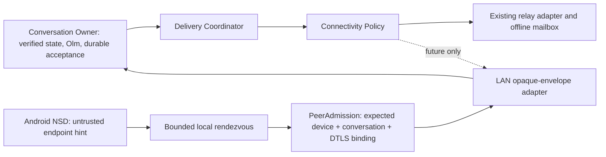

# Phase 2D — LAN production transport decision analysis

**Status:** Architecture direction only; no production rollout approval. [ADR 0009](adr/0009-lan-transport-architecture.md) records the decision. Relay remains the sole active transport.

## Evidence and scope

The [isolated spike](spike-report.md) demonstrates same-host multicast and dummy TCP round trips, plus emulator-to-desktop connectivity by manual address. It does **not** establish real-device NSD reliability, browser feasibility, offline cold-start behavior, DataChannel feasibility, security admission, or delivery semantics. HANDOFF §3 Phase 2 requires at least three real devices plus a desktop and owner decisions D13/D14/M6 before production LAN work. Consequently this analysis selects an architecture to validate, while the production path remains **NO-GO**.

Official platform references: [Android NSD](https://developer.android.com/develop/connectivity/wifi/use-nsd), [Android local-network permission guidance](https://developer.android.com/privacy-and-security/local-network-permission), [W3C WebRTC specification](https://www.w3.org/TR/webrtc/), [MDN DataChannel API](https://developer.mozilla.org/en-US/docs/Web/API/WebRTC_API/Using_data_channels). Permissions and browser behavior must be rechecked against target OS/browser versions before implementation.

## Options

| Criterion | mDNS/NSD + TCP | WebRTC DataChannel | Hybrid discovery + DataChannel candidate |
|---|---|---|---|
| Android | Native NSD and sockets; comparatively small carrier; battery/background and permission behavior still need physical-device tests | Native WebRTC library exists for current voice behavior, but a **messaging DataChannel** and offline signaling are new work | Native NSD supplies an endpoint hint; DataChannel is evaluated as carrier; more integration work |
| Ordinary Web | DataChannel available, but no ordinary browser API equivalent to Android NSD plus an arbitrary incoming TCP server; a pure TCP path cannot be shared | Browser-facing carrier; still needs rendezvous/signaling; HTTPS and browser ICE policy can affect local candidates | Browser uses DataChannel with a separately designed rendezvous; offline Web LAN is explicitly deferred |
| Future desktop | Native service discovery and sockets are possible in a packaged app | DataChannel library/runtime required | Desktop can use native discovery with shared carrier contract, subject to later app design |
| Privacy | mDNS advertisement reveals service presence; TCP endpoint reveals local address | ICE candidate gathering and peer connection can expose local/network addresses; relay-only policy must gate gathering | Discovery and ICE both gated by opt-in; greater privacy surface to audit |
| Discovery security | DNS-SD records are untrusted and forgeable; TCP connection proves reachability only | DataChannel does not provide discovery; signaling can be substituted unless authenticated | NSD is an untrusted hint; admission binds expected peer, conversation, fresh transcript and DTLS fingerprints |
| Channel authentication | Plain TCP lacks M5 channel binding; requires a reviewed authenticated channel | DTLS fingerprint is a candidate channel-binding value, but must be bound to existing device identities by approved PeerAdmission | Uses the DataChannel binding candidate; avoids blessing raw TCP as authenticated |
| NAT / internet direct | Works only if endpoints are mutually reachable or a separate traversal scheme is added | ICE can search direct paths; TURN may relay a live connection when policy permits | Same DataChannel carrier can be evaluated for later internet-direct, with separate policy and rendezvous |
| Complexity | Lower initial native transport complexity, higher cross-platform divergence and new channel-security design | Higher ICE/signaling/runtime complexity; stronger carrier reuse potential | Highest initial integration/testing cost, clearer platform and security boundaries |

These are platform/design assessments, not measured K3NCRYPT production results. WebRTC transport encryption is additional to, and never a replacement for, Vodozemac E2EE. TURN is not the offline mailbox.

## Recommended boundaries and flow

The local rendezvous is not a contact exchange or trust event. Its exact format, authenticated transcript, version negotiation, replay cache, and resource limits require a separate reviewed specification and cross-platform fixtures. Use host-only ICE for a physically offline same-LAN test; do not depend on public STUN/TURN or relay signaling in that test. A future internet-direct path can reuse the DataChannel envelope carrier but requires authenticated online rendezvous and its own privacy/ICE policy. A relay fallback remains essential for disconnected recipients and old clients.

Only already encrypted envelopes cross the adapter. The coordinator submits the saved ciphertext once per attempt; an ambiguous outcome may be retried across paths only after path-independent ID, pre-decrypt dedupe, crash-consistent acceptance, and authenticated receipts are implemented. Adapter success is `submitted`, not `receiver-accepted` or `peer-persisted`. Existing message acceptance and ACK semantics do not change.

## Phased implementation and migration from relay-only

1. **Decision validation, no production changes:** run the [test plan](lan-decision-test-plan.md) on real Android devices and desktop. Compare NSD discovery, offline host-only DataChannel cold start, and a separately reviewed TCP secure-channel alternative. Record D13 from evidence; obtain D14 and M6 owner/security decisions. Stop if prerequisites fail.
2. **Security specifications:** approve M5 transcript and channel binding, authenticated capability rollout (old relays reject unknown IDs), versioned rendezvous, privacy policy, bounds, cancellation, and teardown. Keep service discovery data free of stable identity values. New dependencies trigger HANDOFF §0.4 review.
3. **Android verified-contact LAN, flag off by default:** only after Phase 1 delivery/crash/receipt/ID gates and a spike **go**. Add native discovery/rendezvous and one opaque-envelope adapter behind the existing coordinator; preserve relay selection and all current message behavior. Test two verified Android devices offline in both directions after restart.
4. **Wider LAN support:** evaluate native desktop discovery and browser rendezvous separately. Do not imply browsers can join an offline LAN merely because DataChannel is present. No offline first-contact pairing.
5. **Internet direct:** reuse reviewed envelope carrier where possible, with independent authenticated rendezvous and ICE/TURN privacy choices. Direct remains an optimization; relay mailbox continues to serve offline delivery.

Rollback at every stage is the non-relay flag off. Existing records load with relay-only defaults. A path transition does not change identity, verification, trust, conversation mode, or the Olm session.

## Security requirements and open decisions

- **Admission:** verified unchanged contact, expected active device, healthy session, current required freshness; both nonces, roles, identity references, conversation, versions, and transport binding authenticated. Reject replay/reflection, wrong peer/conversation/fingerprint, unsupported version, missing freshness, and changed identity before accepting an envelope.
- **Network exposure:** global and per-contact opt-in precedes advertising, NSD browse, rendezvous, and ICE. Default remains relay-only; local advertising remains off/foreground-only pending D14. Never log local IPs/candidates, contact names, fingerprints or service records.
- **Availability:** bounded unauthenticated frames, timeouts, rate/concurrency limits, cancellation, Doze/network-change cleanup. Discovery and negotiation failures leave relay and outbox intact.
- **Delivery:** stable envelope identity and durable dedupe before decrypt; no fabricated receiver acceptance from TCP ACK, SCTP/DataChannel send, or DTLS success. A peer-persisted state requires a valid authenticated receipt.
- **Freshness:** M6 remains open. If required trust evidence is unavailable offline, fail closed for LAN; do not guess that a cached signature proves no newer revocation.
- **Open:** final D13 carrier, D14 advertising/permission UX, M6 owner choice, offline browser rendezvous, Android resource budget, and the reviewed transport binding if a TCP alternative is considered.
