# Invitation and verification UX flow

**Scope:** future design. Existing beta behavior and verification rules are unchanged.

The detailed recommended ceremony and security gates are in [verification ceremony design](verification-ceremony-design.md).

```mermaid
stateDiagram-v2
  [*] --> InviteReady: creator publishes room and pre-keys
  InviteReady --> InviteShared: share existing URL fragment / QR
  InviteShared --> JoinPending: recipient scans or pastes
  JoinPending --> Unverified: strict parse, room admission, identity-bundle binding
  JoinPending --> JoinFailed: invalid / unavailable / network failure
  Unverified --> CeremonyReady: both authenticated identity descriptors available
  CeremonyReady --> Comparing: users compare current SAS out of band
  Comparing --> Verified: each user explicitly confirms locally
  Comparing --> Unverified: mismatch / cancel / timeout
  Verified --> Changed: identity or binding changes
  Changed --> Unverified: explicit review; fresh comparison required
```

## Creator

1. Choose **Invite a contact**. Generate the existing modern room invitation; show a QR and copy/share link with identical content. State that the link grants access to the contact setup and should be shared privately. It does not prove who scans it.
2. After sharing, show **Waiting for your contact**. A room shell, relay presence, route hint, or QR scan is not a trusted contact. An authenticated join introduction may create the contact record with **Unverified** status once the joiner's identity descriptor is validated and persisted.
3. If the contact is unavailable or the introduction has not arrived, keep the invitation and a clear retry/refresh action. Do not fabricate a fingerprint or SAS from a missing peer descriptor.

## Joiner

1. Scan QR, open an approved app link, or paste the invitation. Parse the same four fields. Before any server operation, explain that the QR may have been forwarded or replaced.
2. Validate room/pre-key availability and bind the fetched public identity to the invitation commitment. Create a **contact awaiting verification**, never a verified contact. Distinguish malformed link, unavailable room/pre-key, service outage, identity mismatch, and interrupted local secure-key publication without displaying sensitive values.
3. Display the peer's claimed fingerprint while joining is pending. The claim becomes a locally observed identity only after the existing authenticated checks. A display name or nickname is for recognition, not proof.

## Verification ceremony

1. Offer **Verify contact** only when both sides have the required authenticated identity descriptors and a fresh ceremony can be established. On a mixed-version contact, show the existing full-fingerprint comparison instead.
2. Both devices show the same ceremony label, contact/device context, a reviewed SAS display, and an explicit **Compare using another trusted way** instruction. Merely scanning the invitation, receiving a message, matching a code pasted through the same chat, or seeing an identical screen on one device is not completion.
3. Each user independently selects **Codes match** only after direct comparison. **Codes differ**, timeout, cancellation, identity change, or session replacement ends the ceremony and leaves the contact unverified. There is no remote-controlled accept button.
4. Persist verification only through the existing local trust authority. Show **Verified on this device** only when its stored verification state says so and the identity remains unchanged. The other side may still be unverified.

## Platform notes

| Web | Android |
|---|---|
| Current creator shares a full same-origin URL; joiner accepts full URL or fragment. Browser refresh relocks the local vault. Deep links may open the browser rather than the app. | Current creator shares a fragment through Android Sharesheet, clipboard, or QR; joiner can paste or scan. App-link registration and secure handoff need a separate implementation decision. Device unlock protects local storage. |
| Has a distinct public-only fingerprint verification QR and a persisted `contact-identity` verification record. | Has invitation QR/scanner and manual fingerprint entry. Current saved-conversation `isTrusted` is route/fingerprint based; verify its semantics before showing a future SAS-verified label. |

## Copy and accessibility acceptance

Use separate words for **invitation accepted**, **contact added**, **identity unverified**, and **verified on this device**. Provide a textual alternative to QR, accessible reading/grouping of the SAS, explicit mismatch and expiration actions, and no color-only status. Do not display the capability or complete invite in error banners or logs. Avoid countdown promises until the protocol supplies a verifiable expiry.
